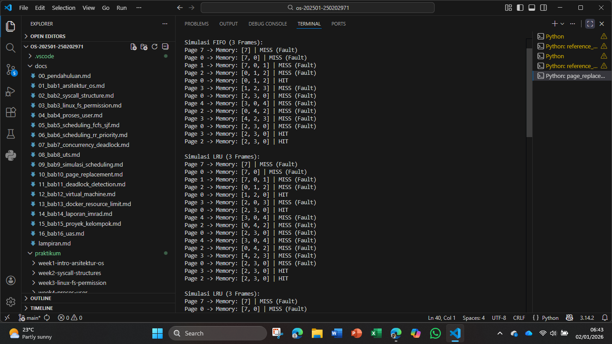

# Laporan Praktikum Minggu [X]
Topik: Manajemen Memori – Page Replacement (FIFO & LRU)
---

## Identitas
- **Nama**  : Yusuf Anwar
- **NIM**   : 250202971
- **Kelas** : 1IKRB

---

## Tujuan
mahasiswa mampu:
1. Mengimplementasikan algoritma page replacement FIFO dalam program.
2. Mengimplementasikan algoritma page replacement LRU dalam program.
3. Menjalankan simulasi page replacement dengan dataset tertentu.
4. Membandingkan performa FIFO dan LRU berdasarkan jumlah *page fault*.
5. Menyajikan hasil simulasi dalam laporan yang sistematis.

---

## Dasar Teori
1. Konsep Memori Virtual Memori virtual adalah teknik manajemen memori yang dikembangkan untuk kernel sistem operasi agar dapat menjalankan program yang lebih besar dari kapasitas RAM fisik. Teknik ini menggunakan mekanisme paging, di mana data dibagi menjadi potongan kecil berukuran tetap yang disebut page di disk dan frame di memori utama.

2. Mekanisme Page Fault Page fault terjadi apabila program mencoba mengakses halaman yang saat itu belum dimuat ke dalam RAM fisik. Ketika kondisi ini terjadi, sistem operasi harus menginterupsi jalannya program, mencari halaman yang dibutuhkan di penyimpanan sekunder, dan menempatkannya ke dalam salah satu frame di memori utama.

3. Prinsip Algoritma FIFO First-In First-Out merupakan algoritma paling sederhana yang memperlakukan frame memori sebagai sebuah struktur antrean. Halaman yang masuk paling awal akan ditempatkan di depan antrean dan menjadi kandidat utama untuk diganti (di-swap) ketika memori penuh, terlepas dari seberapa sering halaman tersebut sebenarnya digunakan oleh CPU.

---

## Langkah Praktikum
1. **Menyiapkan Dataset**

   Gunakan *reference string* berikut sebagai contoh:
   ```
   7, 0, 1, 2, 0, 3, 0, 4, 2, 3, 0, 3, 2
   ```
   Jumlah frame memori: **3 frame**.

2. **Implementasi FIFO**

   - Simulasikan penggantian halaman menggunakan algoritma FIFO.
   - Catat setiap *page hit* dan *page fault*.
   - Hitung total *page fault*.

3. **Implementasi LRU**

   - Simulasikan penggantian halaman menggunakan algoritma LRU.
   - Catat setiap *page hit* dan *page fault*.
   - Hitung total *page fault*.

4. **Eksekusi & Validasi**

   - Jalankan program untuk FIFO dan LRU.
   - Pastikan hasil simulasi logis dan konsisten.

5. 

---

## Kode / Perintah
Tuliskan potongan kode atau perintah utama:
```bash
def simulate_fifo(pages, capacity):
    memory = []
    page_faults = 0
    print(f"\nSimulasi FIFO ({capacity} Frames):")
    
    for page in pages:
        if page not in memory:
            if len(memory) >= capacity:
                memory.pop(0)  
            memory.append(page)
            page_faults += 1
            status = "MISS (Fault)"
        else:
            status = "HIT"
        print(f"Page {page} -> Memory: {memory} | {status}")
    
    return page_faults

def simulate_lru(pages, capacity):
    memory = []
    page_faults = 0
    print(f"\nSimulasi LRU ({capacity} Frames):")
    
    for page in pages:
        if page not in memory:
            if len(memory) >= capacity:
                memory.pop(0) 
            memory.append(page)
            page_faults += 1
            status = "MISS (Fault)"
        else:
            
            memory.remove(page)
            memory.append(page)
            status = "HIT"
        print(f"Page {page} -> Memory: {memory} | {status}")
        
    return page_faults


reference_string = [7, 0, 1, 2, 0, 3, 0, 4, 2, 3, 0, 3, 2]
frames = 3

fifo_faults = simulate_fifo(reference_string, frames)
lru_faults = simulate_lru(reference_string, frames)

print("\n" + "="*30)
print(f"Total Page Fault FIFO: {fifo_faults}")
print(f"Total Page Fault LRU:  {lru_faults}")
```

---

## Hasil Eksekusi



---

## Analisis
**1. Analisis Perbandingan**

   | Algoritma | Jumlah Page Fault | Keterangan |
   |:--|:--:|:--|
   | FIFO |10| Sederhana, namun menghapus "0" saat dibutuhkan kembali oleh sistem. |
   | LRU | 8 | Lebih cerdas; mendeteksi bahwa "0" sering digunakan sehingga tetap mempertahankannya. | 

---

## Kesimpulan
1. Efektivitas Algoritma Hasil simulasi menunjukkan bahwa LRU lebih efisien dengan total 8 page fault dibandingkan FIFO yang menghasilkan 10 page fault. Hal ini membuktikan bahwa algoritma yang memantau riwayat pemakaian halaman jauh lebih optimal dalam menekan angka kesalahan memori.

2. Prinsip Kerja FIFO memiliki kelemahan karena menghapus halaman hanya berdasarkan waktu masuknya tanpa melihat kebutuhan sistem, sedangkan LRU mampu mempertahankan halaman yang sering diakses. Strategi LRU ini sangat efektif dalam mengurangi proses I/O yang berat antara memori utama dan disk.
---

## Quiz
1. Apa perbedaan utama FIFO dan LRU? 
   **Jawaban:**  FIFO didasarkan pada waktu kedatangan (kapan page masuk ke memori). Halaman tertua akan diganti terlebih dahulu.sedangkan LRU didasarkan pada waktu penggunaan terakhir. Halaman yang sudah paling lama tidak diakses oleh CPU akan diganti.
2. Mengapa FIFO dapat menghasilkan Belady’s Anomaly?
   **Jawaban:**  Belady's Anomaly adalah fenomena di mana jumlah page fault justru meningkat seiring bertambahnya jumlah frame memori. Hal ini terjadi pada FIFO karena ia tidak mempertimbangkan pola akses program, sehingga menambah frame bisa menyebabkan halaman yang sangat dibutuhkan justru terbuang lebih awal dalam siklus antrean.
3. Mengapa LRU umumnya menghasilkan performa lebih baik dibanding FIFO?
   **Jawaban:**  LRU bekerja berdasarkan asumsi statistik bahwa data yang baru saja diakses memiliki probabilitas tinggi untuk diakses kembali (Locality of Reference). Dengan mempertahankan halaman yang aktif digunakan, LRU meminimalkan kebutuhan untuk memuat ulang data dari disk ke RAM.

---

## Refleksi Diri
Tuliskan secara singkat:
- Apa bagian yang paling menantang minggu ini?  
  **Jawaban:** bagian codingnya banyak yg error dan sulit untuk mencari letak kesalahannya
- Bagaimana cara Anda mengatasinya?  
  **Jawaban:** mencari error satu per satu dan memperbaiki logika program
---

**Credit:**  
_Template laporan praktikum Sistem Operasi (SO-202501) – Universitas Putra Bangsa_
