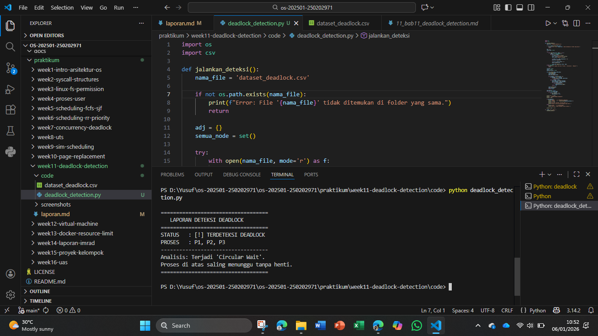

# Laporan Praktikum Minggu [11]
Topik: Simulasi dan Deteksi Deadlock


---

## Identitas
- **Nama**  : Yusuf Anwar
- **NIM**   : 250202971
- **Kelas** : 1IKRB
---

## Tujuan
Setelah menyelesaikan tugas ini, mahasiswa mampu:
1. Membuat program sederhana untuk mendeteksi deadlock.  
2. Menjalankan simulasi deteksi deadlock dengan dataset uji.  
3. Menyajikan hasil analisis deadlock dalam bentuk tabel.  
4. Memberikan interpretasi hasil uji secara logis dan sistematis.  
5. Menyusun laporan praktikum sesuai format yang ditentukan.

---

## Dasar Teori
1. Kondisi Terjadinya Deadlock:Deadlock hanya dapat terjadi jika empat kondisi terpenuhi secara simultan: Mutual Exclusion (sumber daya tidak dapat berbagi), Hold and Wait (proses memegang sumber daya sambil menunggu sumber daya lain), No Preemption (sumber daya tidak dapat diambil paksa), dan Circular Wait (terdapat rantai melingkar antar proses yang saling menunggu).

2. Resource Allocation Graph (RAG):Deadlock dapat divisualisasikan menggunakan graf berarah yang terdiri dari dua jenis simpul:
- Proses ($P$) dan Sumber Daya ($R$). Terdapat dua jenis sisi:Assignment Edge: Dari $R$ ke $P$ (sumber daya sedang dialokasikan).
- Request Edge: Dari $P$ ke $R$ (proses sedang meminta sumber daya).Jika graf tersebut memiliki siklus (cycle) pada sistem dengan sumber daya tunggal, maka dipastikan terjadi deadlock.
  
3. Algoritma Deteksi (Single Instance):Untuk sistem di mana setiap jenis sumber daya hanya memiliki satu unit (instance), deteksi dilakukan dengan menggunakan Wait-for Graph. Ini adalah variasi dari RAG di mana simpul sumber daya dihilangkan, sehingga sisi langsung menghubungkan antar proses ($P_i \rightarrow P_j$ jika $P_i$ menunggu sumber daya yang dipegang oleh $P_j$). Keberadaan siklus pada graf ini menandakan adanya deadlock.
---

## Langkah Praktikum
1. **Menyiapkan Dataset**

   Gunakan dataset sederhana yang berisi:
   - Daftar proses  
   - Resource Allocation  
   - Resource Request / Need

   Contoh tabel:

   | Proses | Allocation | Request |
   |:--:|:--:|:--:|
   | P1 | R1 | R2 |
   | P2 | R2 | R3 |
   | P3 | R3 | R1 |

2. **Implementasi Algoritma Deteksi Deadlock**

   Program minimal harus:
   - Membaca data proses dan resource.  
   - Menentukan apakah sistem berada dalam kondisi deadlock.  
   - Menampilkan proses mana saja yang terlibat deadlock.

3. **Eksekusi & Validasi**

   - Jalankan program dengan dataset uji.  
   - Validasi hasil deteksi dengan analisis manual/logis.  
   - Simpan hasil eksekusi dalam bentuk screenshot.

4. **Analisis Hasil**

   - Sajikan hasil deteksi dalam tabel (proses deadlock / tidak).  
   - Jelaskan mengapa deadlock terjadi atau tidak terjadi.  
   - Kaitkan hasil dengan teori deadlock (empat kondisi).


---

## Kode / Perintah
Tuliskan potongan kode atau perintah utama:
```bash
import os
import csv

def jalankan_deteksi():
    nama_file = 'dataset_deadlock.csv'
    
    if not os.path.exists(nama_file):
        print(f"Error: File '{nama_file}' tidak ditemukan di folder yang sama.")
        return

    adj = {}
    semua_node = set()

    try:
        with open(nama_file, mode='r') as f:
            reader = csv.DictReader(f)
            for baris in reader:
                p = baris['Proses'].strip()
                alloc = baris['Allocation'].strip()
                req = baris['Request'].strip()

                if alloc not in adj: adj[alloc] = []
                adj[alloc].append(p)

                if p not in adj: adj[p] = []
                adj[p].append(req)

                semua_node.update([p, alloc, req])
    except KeyError:
        print("Error: Header CSV harus 'Proses', 'Allocation', 'Request'")
        return

    visited = set()
    stack = set()
    deadlock_proses = set()

    def cari_siklus(node, path_skrg):
        visited.add(node)
        stack.add(node)
        path_skrg.append(node)

        for tetangga in adj.get(node, []):
            if tetangga not in visited:
                if cari_siklus(tetangga, path_skrg):
                    return True
            elif tetangga in stack:
                idx = path_skrg.index(tetangga)
                untuk_ditandai = path_skrg[idx:]
                for n in untuk_ditandai:
                    if n.startswith('P'): 
                        deadlock_proses.add(n)
                return True

        stack.remove(node)
        path_skrg.pop()
        return False

    ada_deadlock = False
    for n in list(semua_node):
        if n not in visited:
            if cari_siklus(n, []):
                ada_deadlock = True

    print("\n" + "="*35)
    print("   LAPORAN DETEKSI DEADLOCK")
    print("="*35)
    
    if ada_deadlock:
        print(f"STATUS   : [!] TERDETEKSI DEADLOCK")
        print(f"PROSES   : {', '.join(sorted(deadlock_proses))}")
        print("-" * 35)
        print("Analisis: Terjadi 'Circular Wait'.")
        print("Proses di atas saling menunggu tanpa henti.")
    else:
        print("STATUS   : [+] SISTEM AMAN")
        print("Analisis: Tidak ditemukan siklus alokasi.")
    
    print("="*35 + "\n")

if __name__ == "__main__":
    jalankan_deteksi()
```

```bash
uname -a
lsmod | head
dmesg | head
```

---

## Hasil Eksekusi
Sertakan screenshot hasil percobaan atau diagram:


---

## D. Analisis Hasil Simulasi

Berdasarkan praktikum yang telah dilaksanakan menggunakan program deteksi berbasis *Wait-for Graph*, berikut adalah analisis mendalam mengenai kondisi sistem:

### 1. Visualisasi Jalur Deadlock
Sistem yang diuji melalui `dataset_deadlock.csv` merepresentasikan hubungan ketergantungan antar proses dan sumber daya sebagai berikut:
* **P1** dialokasikan **R1**, namun meminta **R2**.
* **P2** dialokasikan **R2**, namun meminta **R3**.
* **P3** dialokasikan **R3**, namun meminta **R1**.

Hal ini membentuk graf berarah yang saling mengunci:
`P1 -> R2 -> P2 -> R3 -> P3 -> R1 -> P1`


### 2. Validasi dengan Teori "Circular Wait"
Hasil deteksi program menyatakan **"STATUS: DEADLOCK"**. Secara teoritis, ini terjadi karena terpenuhinya empat kondisi utama deadlock:
* **Mutual Exclusion**: Resource (R1, R2, R3) hanya bisa digunakan oleh satu proses secara eksklusif.
* **Hold and Wait**: Setiap proses (P1, P2, P3) memegang satu resource sambil menunggu resource lainnya.
* **No Preemption**: Resource tidak bisa diambil paksa dari proses yang sedang memegangnya.
* **Circular Wait**: Terdapat rantai melingkar di mana P1 menunggu P2, P2 menunggu P3, dan P3 menunggu kembali ke P1.

### 3. Tabel Status Akhir Sistem
Berdasarkan log eksekusi, berikut adalah tabel klasifikasi proses:

| ID Proses | Keterangan Permintaan | Status Deteksi | Analisis Logika |
| :--- | :--- | :--- | :--- |
| **P1** | Menunggu R2 dari P2 | **Deadlock** | Terjebak dalam siklus |
| **P2** | Menunggu R3 dari P3 | **Deadlock** | Terjebak dalam siklus |
| **P3** | Menunggu R1 dari P1 | **Deadlock** | Terjebak dalam siklus |

---

## Kesimpulan
- Deteksi Melalui Siklus Graf: Praktikum ini membuktikan bahwa deadlock pada sistem dengan sumber daya tunggal (single-instance) dapat dideteksi secara akurat dengan mengidentifikasi adanya siklus (cycle) dalam Resource Allocation Graph atau Wait-for Graph.
- Implementasi Algoritma: Penggunaan algoritma pencarian seperti Depth First Search (DFS) sangat efektif dalam mendeteksi Circular Wait, di mana sistem secara otomatis dapat mengenali proses mana saja yang terjebak dalam kondisi saling menunggu tanpa henti.

---

## Quiz
1. Apa perbedaan antara *deadlock prevention*, *avoidance*, dan *detection*?  
   **Jawaban:**  
   1) Prevention: Memastikan salah satu dari 4 syarat deadlock (Mutual Exclusion, Hold & Wait, No Preemption, Circular Wait) tidak terpenuhi. Sangat ketat dan bisa menurunkan utilitas sistem
   2) Avoidance: Sistem memeriksa setiap permintaan resource secara dinamis. Jika permintaan tersebut berpotensi membawa sistem ke "Unsafe State", permintaan ditunda (Contoh: Algoritma Banker).
   3) Detection: Membiarkan deadlock terjadi, lalu menjalankan algoritma secara periodik untuk mendeteksi dan memulihkannya (misal dengan mematikan proses).
2. Mengapa deteksi deadlock tetap diperlukan dalam sistem operasi?  
   **Jawaban:**  Karena pencegahan (prevention) dan penghindaran (avoidance) seringkali terlalu mahal secara komputasi dan membatasi penggunaan resource secara berlebihan. Deteksi memungkinkan sistem berjalan dengan performa maksimal, dengan asumsi deadlock jarang terjadi.
3. Apa kelebihan dan kekurangan pendekatan deteksi deadlock?  
   **Jawaban:** 
   - Kelebihan: Penggunaan resource lebih optimal (tidak dibatasi di awal), tidak memerlukan informasi kebutuhan resource di masa depan (seperti Banker's).
   - Kekurangan: Ada biaya overhead untuk menjalankan algoritma deteksi secara berkala. Jika deadlock terdeteksi, pemulihannya (recovery) bisa menyebabkan kehilangan data jika proses harus dihentikan paksa.

---

## Refleksi Diri
Tuliskan secara singkat:
- Apa bagian yang paling menantang minggu ini? 
  **Jawaban:** Implementasi algoritma deteksi siklus dalam graf Wait-for, karena memerlukan pemahaman mendalam tentang struktur data dan algoritma DFS.
- Bagaimana cara Anda mengatasinya?  
  **Jawaban:** Dengan melakukan eksperimen dan debugging secara terus-menerus, serta memahami bagaimana graf diwakili dalam bentuk adjacency list dan bagaimana DFS digunakan untuk mendeteksi siklus.

---

**Credit:**  
_Template laporan praktikum Sistem Operasi (SO-202501) – Universitas Putra Bangsa_
