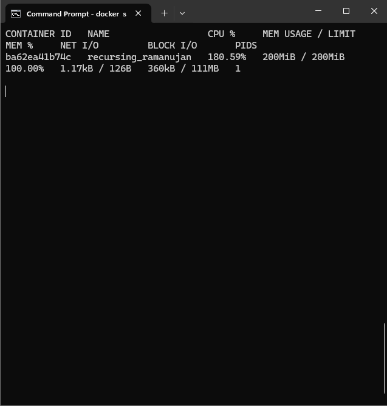
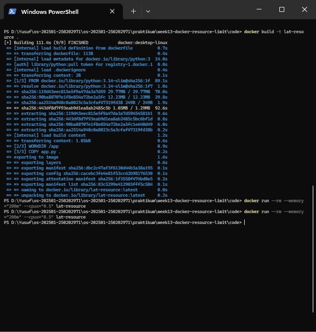
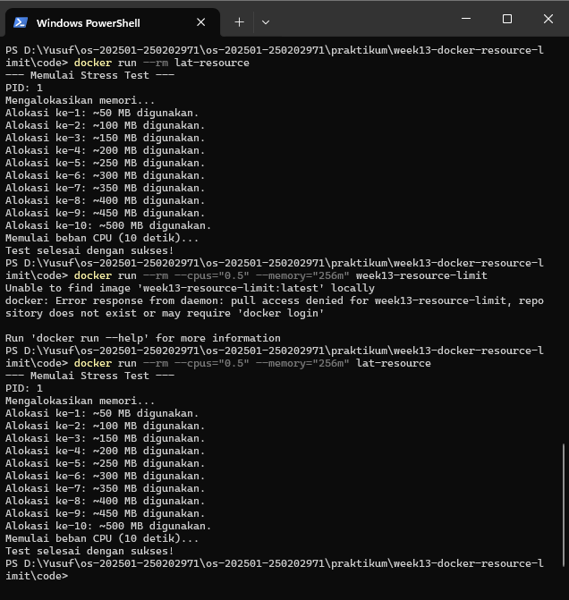

# Laporan Praktikum Minggu [X]
Topik: Docker – Resource Limit (CPU & Memori)

---

## Identitas
- **Nama**  : Yusuf Anwar
- **NIM**   : 250202971
- **Kelas** : 1IKRB

---

## Tujuan
1. Menulis Dockerfile sederhana untuk sebuah aplikasi/skrip.
2. Membangun image dan menjalankan container.
3. Menjalankan container dengan pembatasan **CPU** dan **memori**.
4. Mengamati dan menjelaskan perbedaan eksekusi container dengan dan tanpa limit resource.
5. Menyusun laporan praktikum secara runtut dan sistematis.

---

## Dasar Teori
1. Containerization: Teknologi untuk membungkus aplikasi beserta seluruh dependensinya agar dapat berjalan secara konsisten di lingkungan mana pun.
2. Resource Isolation: Mekanisme yang memastikan setiap container hanya mendapatkan jatah sumber daya tertentu tanpa mengganggu container lain atau OS host.
3. Cgroups (Control Groups): Fitur kernel Linux yang digunakan Docker untuk mengatur, membatasi, dan memantau penggunaan resource seperti CPU, Memori, dan I/O.
4. OOM (Out of Memory) Killer: Fitur sistem operasi yang secara otomatis mematikan proses (dalam hal ini container) jika penggunaan memorinya melebihi batas yang ditentukan (limit) guna menjaga stabilitas sistem.

---

## Langkah Praktikum
1. **Persiapan Lingkungan**

   - Pastikan Docker terpasang dan berjalan.
   - Verifikasi:
     ```bash
     docker version
     docker ps
     ```

2. **Membuat Aplikasi/Skrip Uji**

   Buat program sederhana di folder `code/` (bahasa bebas) yang:
   - Melakukan komputasi berulang (untuk mengamati limit CPU), dan/atau
   - Mengalokasikan memori bertahap (untuk mengamati limit memori).

3. **Membuat Dockerfile**

   - Tulis `Dockerfile` untuk menjalankan program uji.
   - Build image:
     ```bash
     docker build -t week13-resource-limit .
     ```

4. **Menjalankan Container Tanpa Limit**

   - Jalankan container normal:
     ```bash
     docker run --rm week13-resource-limit
     ```
   - Catat output/hasil pengamatan.

5. **Menjalankan Container Dengan Limit Resource**

   Jalankan container dengan batasan resource (contoh):
   ```bash
   docker run --rm --cpus="0.5" --memory="256m" week13-resource-limit
   ```
   Catat perubahan perilaku program (mis. lebih lambat, error saat memori tidak cukup, dll.).

6. **Monitoring Sederhana**

   - Jalankan container (tanpa `--rm` jika perlu) dan amati penggunaan resource:
     ```bash
     docker stats
     ```
   - Ambil screenshot output eksekusi dan/atau `docker stats`.

---

## Kode / Perintah
Tuliskan potongan kode atau perintah utama:
```bash
import time
import os

def stress_test():
    print("--- Memulai Stress Test ---")
    print(f"PID: {os.getpid()}")
    
    # Simulasi Penggunaan Memori (Alokasi list besar)
    try:
        print("Mengalokasikan memori...")
        memory_hog = []
        for i in range(1, 11):
            # Menambah sekitar 50MB setiap iterasi
            memory_hog.append(' ' * (50 * 1024 * 1024)) 
            print(f"Alokasi ke-{i}: ~{i * 50} MB digunakan.")
            time.sleep(1)
            
        # Simulasi Penggunaan CPU (Perhitungan berat)
        print("Memulai beban CPU (10 detik)...")
        end_time = time.time() + 10
        while time.time() < end_time:
            _ = 1000 * 1000  # Operasi CPU
            
        print("Test selesai dengan sukses!")
        
    except MemoryError:
        print("\n[ERROR] Memory Limit Terlampaui! (OOM)")
    except Exception as e:
        print(f"\n[ERROR] Terjadi kesalahan: {e}")

if __name__ == "__main__":
    stress_test()
```

---

## Hasil Eksekusi
Sertakan screenshot hasil percobaan atau diagram:





---

## Analisis
- Hasil Tanpa Limit: Program berjalan hingga selesai (10 langkah) karena Docker dibebaskan menggunakan resource CPU dan RAM yang tersedia pada OS host secara maksimal.

- Hasil Dengan Limit: Ketika dibatasi --memory="200m", program terhenti atau crash di sekitar langkah ke-4 atau ke-5. Hal ini terjadi karena kode Python terus menambah beban RAM (50MB x 5) hingga melewati batas 200MB, sehingga Kernel melakukan OOM Kill.

- CPU Throttling: Dengan limit --cpus="0.5", proses perhitungan matematika terasa lebih lambat karena container hanya diberikan jatah waktu eksekusi sebesar 50% dari satu inti CPU.

- Perbedaan Lingkungan: Di Windows (Docker Desktop), pembatasan ini dikelola melalui VM ringan (WSL2), sedangkan di Linux asli, pembatasan langsung ditangani oleh kernel melalui cgroups secara native, yang biasanya lebih efisien.
---

## Kesimpulan

1. Pembatasan resource sangat penting dalam pengelolaan server agar satu aplikasi yang bermasalah tidak menghabiskan seluruh sumber daya sistem (mencegah system crash).
2. Docker mempermudah pembatasan resource melalui parameter sederhana (--cpus dan --memory) tanpa perlu melakukan konfigurasi kernel secara manual.
3. Keberhasilan pembatasan dapat dipantau secara langsung menggunakan perintah docker stats.

---

## Quiz
1. Mengapa container perlu dibatasi CPU dan memori?  
   **Jawaban:**  Untuk mencegah fenomena "Noisy Neighbor", di mana satu container menghabiskan seluruh resource host yang dapat menyebabkan container lain menjadi lambat atau mati, serta untuk memastikan efisiensi dan keadilan distribusi resource antar aplikasi.
2. Apa perbedaan VM dan container dalam konteks isolasi resource?  
   **Jawaban:**  M melakukan isolasi di level hardware melalui Hypervisor, di mana resource sudah dipotong/dialokasikan sejak awal (Virtual Hardware). Sedangkan Container melakukan isolasi di level OS menggunakan namespaces dan cgroups, sehingga lebih ringan karena tetap berbagi kernel yang sama dengan host.
3. Apa dampak limit memori terhadap aplikasi yang boros memori?  
   **Jawaban:**  Aplikasi akan mengalami kegagalan fungsi. Sistem (Docker/Kernel) akan mengirimkan sinyal penghentian paksa (OOM Kill) atau aplikasi akan mengeluarkan error MemoryError karena tidak mendapatkan ruang alokasi baru saat mencoba menambah data.

---

## Refleksi Diri
Tuliskan secara singkat:
- Apa bagian yang paling menantang minggu ini? 
   **Jawaban:**  Bagian yang paling menantang adalah memahami cara kerja terminal untuk berpindah antar direktori (Disk C ke D) serta memahami bagaimana Dockerfile diterjemahkan menjadi sebuah Image yang bisa berjalan.
- Bagaimana cara Anda mengatasinya? 
  **Jawaban:**   Saya mengatasinya dengan mempelajari perintah dasar terminal (seperti cd, dir, dan perpindahan drive) serta melakukan eksperimen mandiri dengan mengubah-ubah angka limit pada perintah docker run untuk melihat hasilnya secara langsung di docker stats.

---

**Credit:**  
_Template laporan praktikum Sistem Operasi (SO-202501) – Universitas Putra Bangsa_
