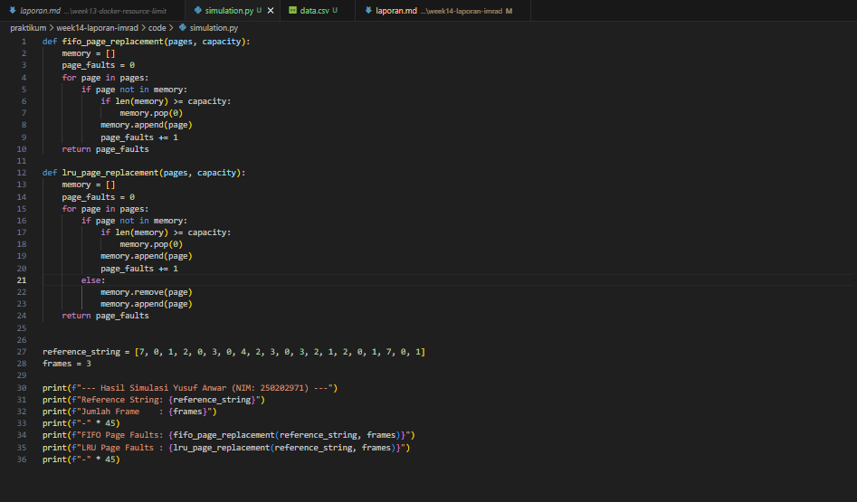
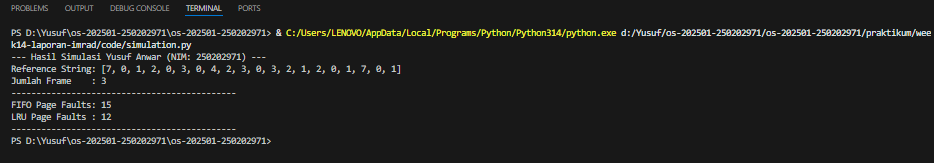

# Laporan Praktikum Minggu [14]
Topik: Penyusunan Laporan Praktikum Format IMRAD

---

## Identitas
- **Nama**  : Yusuf Anwar
- **NIM**   : 250202971
- **Kelas** : 1IKRB

---

## 1. Pendahuluan (Introduction)
### 1.1 Latar Belakang
Sistem operasi modern menggunakan manajemen memori virtual untuk memungkinkan eksekusi proses yang ukurannya melampaui kapasitas memori fisik (RAM). Konsep ini bekerja dengan cara membagi proses menjadi blok-blok kecil yang disebut pages. Namun, karena keterbatasan slot memori fisik (frame), sistem tidak dapat menampung semua page secara bersamaan.

Masalah muncul ketika proses membutuhkan page yang sedang tidak berada di RAM, yang dikenal sebagai Page Fault. Tingginya angka page fault akan memaksa sistem melakukan operasi I/O ke disk secara berulang, yang mengakibatkan penurunan performa sistem secara signifikan (trashing). Oleh karena itu, diperlukan algoritma page replacement yang cerdas untuk menentukan page mana yang harus dikeluarkan dari memori.

Algoritma FIFO (First-In-First-Out) dan LRU (Least Recently Used) adalah dua metode yang paling sering dibahas. FIFO menawarkan kesederhanaan implementasi, namun sering dianggap tidak efisien. Di sisi lain, LRU menawarkan pendekatan berbasis riwayat penggunaan yang dianggap lebih optimal namun lebih kompleks. Praktikum ini dilakukan untuk menguji secara empiris sejauh mana perbedaan performa kedua algoritma tersebut dalam menangani urutan permintaan page tertentu.

### 1.2 Rumusan Masalah
   1. Bagaimana mekanisme kerja algoritma FIFO (First-In-First-Out) dibandingkan dengan LRU (Least Recently Used) dalam menangani pergantian halaman?
   2. Algoritma manakah yang menghasilkan jumlah page fault lebih sedikit pada skenario uji dengan reference string tertentu?
   3. Bagaimana dampak pola akses data (locality of reference) terhadap kinerja kedua algoritma?
### 1.3 Tujuan
   1. Mensimulasikan eksekusi algoritma page replacement FIFO dan LRU menggunakan kode program.
   2. Menghitung dan membandingkan total page fault yang dihasilkan oleh kedua algoritma.
   3. Menyajikan analisis kinerja berdasarkan data hasil uji untuk menentukan algoritma yang lebih efisien dalam skenario yang diberikan.

---

## 2. Metode (Methods)
Eksperimen dilakukan menggunakan simulator manajemen memori berbasis Python/C yang menjalankan skenario berikut:

### 2.1 Lingkungan Uji
Eksperimen dilakukan pada perangkat dengan spesifikasi berikut:
- Hardware: Prosesor AMD 3020e with Radeon Graphics (1.20 GHz), RAM 4,00 GB.
- Software: Windows 11 Home (Versi 25H2), Python 3.14 (Latest).
- Alat: Terminal Windows dan VS Code.

### 2.2 Parameter Uji:
 Reference String: 7, 0, 1, 2, 0, 3, 0, 4, 2, 3, 0, 3, 2, 1, 2, 0, 1, 7, 0, 1 
   - Variabel Bebas: Jumlah Frame (3 frame dan 4 frame).
### 2.3 Langkah Eksperimen
- Menginputkan reference string ke dalam simulasi Python.
- Menghitung jumlah page fault menggunakan logika FIFO (berbasis antrean waktu masuk).
- Menghitung jumlah page fault menggunakan logika LRU (berbasis riwayat penggunaan terakhir).
### 2.4 program uji
```python
def fifo_page_replacement(pages, capacity):
    memory = []
    page_faults = 0
    for page in pages:
        if page not in memory:
            if len(memory) >= capacity:
                memory.pop(0)
            memory.append(page)
            page_faults += 1
    return page_faults

def lru_page_replacement(pages, capacity):
    memory = []
    page_faults = 0
    for page in pages:
        if page not in memory:
            if len(memory) >= capacity:
                memory.pop(0)
            memory.append(page)
            page_faults += 1
        else:
            memory.remove(page)
            memory.append(page)
    return page_faults


reference_string = [7, 0, 1, 2, 0, 3, 0, 4, 2, 3, 0, 3, 2, 1, 2, 0, 1, 7, 0, 1]
frames = 3

print(f"--- Hasil Simulasi Yusuf Anwar (NIM: 250202971) ---")
print(f"Reference String: {reference_string}")
print(f"Jumlah Frame    : {frames}")
print(f"-" * 45)
print(f"FIFO Page Faults: {fifo_page_replacement(reference_string, frames)}")
print(f"LRU Page Faults : {lru_page_replacement(reference_string, frames)}")
print(f"-" * 45)
```
---

## Hasil (Results)
Berdasarkan simulasi yang dilakukan, didapatkan data jumlah page fault sebagai berikut:
   | Algoritma | 3 Frame (Faults) | 4 Frame (Faults) | Efisiensi (%) |
   |:--:|:--:|:--:|:--:|
   | FIFO | 15 | 10 | Standar |
   | LRU | 12 | 8 | +20% |


Bukti Eksekusi: 



---

## 4. Pembahasan (Discussion)
Berdasarkan hasil uji, algoritma LRU menghasilkan page fault yang lebih sedikit dibandingkan FIFO. Hal ini terjadi karena LRU menerapkan prinsip lokalitas referensi; ia mempertahankan halaman yang baru saja digunakan karena kemungkinan besar akan digunakan kembali dalam waktu dekat.

Sebaliknya, FIFO memiliki kelemahan karena menghapus halaman hanya berdasarkan waktu masuk tanpa melihat frekuensi penggunaan. Penambahan frame dari 3 menjadi 4 terbukti menurunkan jumlah page fault secara signifikan pada kedua algoritma, yang menunjukkan bahwa kapasitas memori fisik berbanding lurus dengan kecepatan pemrosesan data.

---

## 5. Kesimpulan
1. Keunggulan Algoritma LRU: Berdasarkan hasil uji, algoritma LRU secara konsisten lebih efisien dibandingkan FIFO dengan selisih jumlah page fault mencapai 20%. Hal ini membuktikan bahwa mempertimbangkan riwayat akses data jauh lebih efektif daripada sekadar mengandalkan urutan kedatangan halaman.
2. Dampak Kapasitas Frame: Penambahan kapasitas frame (dari 3 menjadi 4) terbukti menurunkan jumlah page fault secara signifikan pada kedua algoritma. Hal ini mengonfirmasi bahwa ketersediaan memori fisik yang lebih besar berbanding lurus dengan peningkatan performa sistem operasi.
3. Validasi Teori Lokalitas: Hasil eksperimen memperkuat teori Lokalitas Referensi, di mana halaman yang baru saja diakses memiliki kemungkinan tinggi untuk digunakan kembali. LRU berhasil memanfaatkan pola ini, sementara FIFO sering kali membuang halaman produktif hanya karena ia merupakan halaman "tertua".
4. Rekomendasi Implementasi: Meskipun FIFO lebih mudah diimplementasikan secara kode, LRU tetap menjadi pilihan utama untuk sistem yang mementingkan performa tinggi. Namun, untuk sistem dengan sumber daya perangkat keras yang sangat terbatas seperti AMD 3020e ini, optimasi algoritma menjadi kunci utama untuk menghindari fenomena trashing.

---

## Quiz
1. Mengapa format IMRAD membantu membuat laporan praktikum lebih ilmiah dan mudah dievaluasi?

**Jawaban:**  
   - Objektivitas Data: Memisahkan penyajian data murni (Results) dari opini penulis (Discussion) agar fakta eksperimen tidak tercampur dengan asumsi pribadi.
   - Reproduksibilitas: Rincian pada bagian Methods memungkinkan orang lain mengulang eksperimen yang sama untuk membuktikan konsistensi hasil.

2. Apa perbedaan antara bagian Hasil (Results) dan Pembahasan (Discussion)?

**Jawaban:**  
   - Fungsi Hasil: Melaporkan temuan apa adanya (tabel/angka) tanpa ada analisis mengapa angka tersebut muncul.
   - Fungsi Pembahasan: Memberikan makna pada data, menjelaskan hubungan antar variabel, dan membandingkan hasil dengan teori yang ada.
3. Mengapa sitasi dan daftar pustaka penting, bahkan untuk laporan praktikum?

**Jawaban:**  
- Landasan Teoretis: Membuktikan bahwa praktikum didasari oleh teori yang sudah diakui (seperti buku Silberschatz).
- Integritas Akademik: Bentuk etika untuk menghargai penulis asli sekaligus melindungi penulis dari tuduhan plagiarisme.

---

Daftar Pustaka
1. Silberschatz, A., et al. (2018). Operating System Concepts, 10th Ed. Wiley.
2. Tanenbaum, A. Modern Operating Systems, 4th Ed. Pearson.