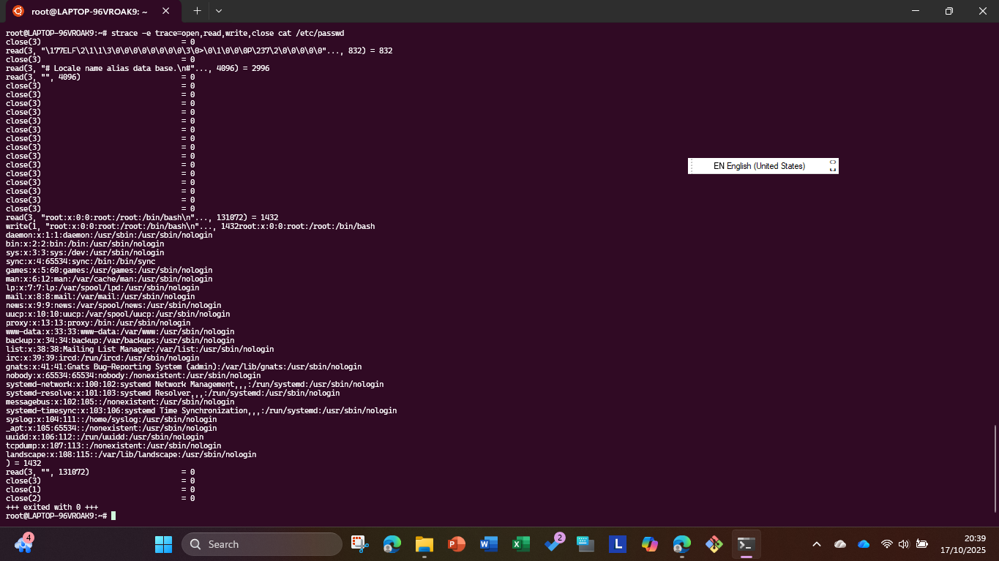
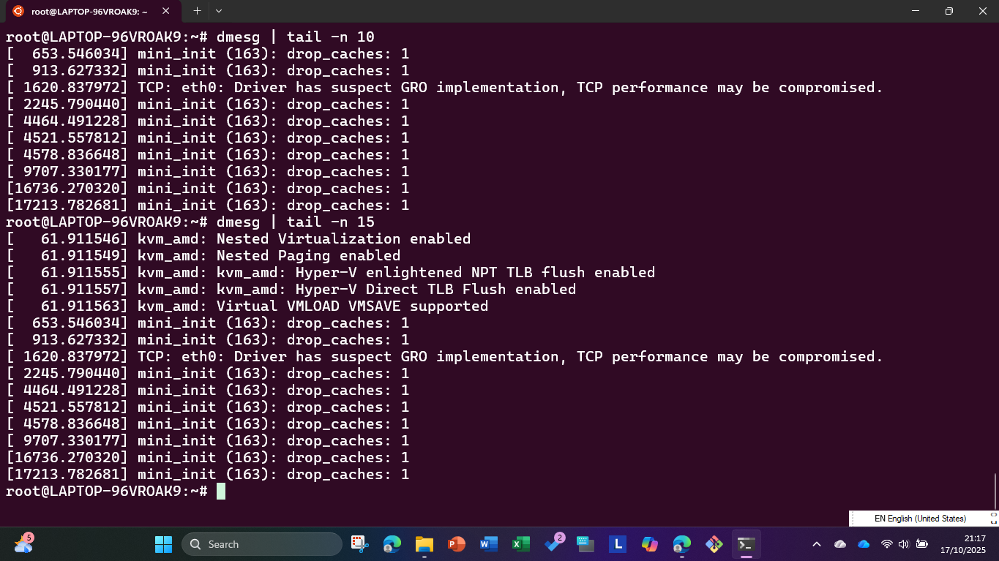
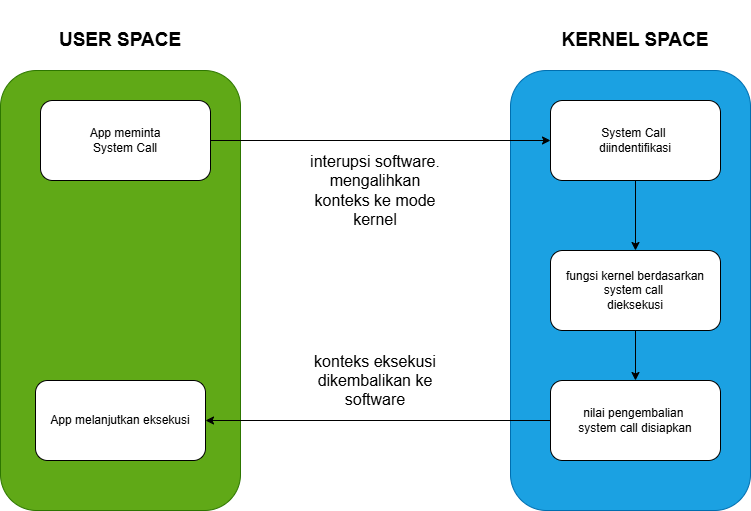

# Laporan Praktikum Minggu [X]
**Topik: struktur system call dan fungsi Kernel**

---

## Identitas
- **Nama**  : Yusuf Anwar  
- **NIM**   : 250202971 
- **Kelas** : 1IKRB

---

## Tujuan
Setelah menyelesaikan tugas ini, mahasiswa mampu:
1. Menjelaskan konsep dan fungsi system call dalam sistem operasi.
2. Mengidentifikasi jenis-jenis system call dan fungsinya.
3. Mengamati alur perpindahan mode user ke kernel saat system call terjadi.
4. Menggunakan perintah Linux untuk menampilkan dan menganalisis system call.
---

## Dasar Teori

---

## Langkah Praktikum
1. **Setup Environment**
   - Gunakan Linux (Ubuntu/WSL).
   - Pastikan perintah `strace` dan `man` sudah terinstal.
   - Konfigurasikan Git (jika belum dilakukan di minggu sebelumnya).

2. **Eksperimen 1 – Analisis System Call**
   Jalankan perintah berikut:
   ```bash
   strace ls
   ```
   > Catat 5–10 system call pertama yang muncul dan jelaskan fungsinya.  
   Simpan hasil analisis ke `results/syscall_ls.txt`.

3. **Eksperimen 2 – Menelusuri System Call File I/O**
   Jalankan:
   ```bash
   strace -e trace=open,read,write,close cat /etc/passwd
   ```
   > Analisis bagaimana file dibuka, dibaca, dan ditutup oleh kernel.

4. **Eksperimen 3 – Mode User vs Kernel**
   Jalankan:
   ```bash
   dmesg | tail -n 10
   ```
   > Amati log kernel yang muncul. Apa bedanya output ini dengan output dari program biasa?

5. **Diagram Alur System Call**
   - Buat diagram yang menggambarkan alur eksekusi system call dari program user hingga kernel dan kembali lagi ke user mode.
   - Gunakan draw.io / mermaid.
   - Simpan di:
     ```
     praktikum/week2-syscall-structure/screenshots/syscall-diagram.png
     ```

6. **Commit & Push**
   ```bash
   git add .
   git commit -m "Minggu 2 - Struktur System Call dan Kernel Interaction"
   git push origin main
   ```
   
---

## Kode / Perintah
Tuliskan potongan kode atau perintah utama:
```bash
uname -a
lsmod | head
dmesg | head
```

---

##  hasil eksperimen :




---

## Analisis
1. Hasil eksperimen ```strace``` dan ```dmesg``` dalam bentuk tabel observasi
   
| Eksperimen | Perintah | Hasil Utama | Analisis Singkat |
|------------|----------|-------------|------------------|
| **Eksperimen 1: Analisis System Call dengan `strace ls`** | `strace ls` | - `execve("/bin/ls", ["ls"], 0x7ffd...) = 0`<br>- `arch_prctl(ARCH_SET_FS, 0x7f1c...) = 0`<br>- `brk(NULL) = 0x55b8...`<br>- `access("/etc/ld.so.nohwcap", F_OK) = -1 ENOENT`<br>- `mmap(NULL, 8192, PROT_READ|PROT_WRITE, MAP_PRIVATE|MAP_ANONYMOUS, -1, 0) = 0x7f1c...` | Output menunjukkan system call awal untuk menjalankan program `ls`, termasuk setup arsitektur, alokasi memori, dan pemeriksaan akses. Ini menggambarkan bagaimana kernel mempersiapkan eksekusi program secara aman, mencegah akses langsung ke resource. |
| **Eksperimen 2: Menelusuri System Call File I/O dengan `strace cat /etc/passwd`** | `strace -e trace=open,read,write,close cat /etc/passwd` | - `openat(AT_FDCWD, "/etc/passwd", O_RDONLY) = 3`<br>- `read(3, "root:x:0:0:root:/root:/bin/bash\n", 8192) = 1234`<br>- `write(1, "root:x:0:0:root:/root:/bin/bash\n", 1234) = 1234`<br>- `close(3) = 0` | System call ini menunjukkan siklus lengkap I/O file: membuka file, membaca isi, menulis ke output, dan menutup. Kernel bertindak sebagai mediator untuk memastikan operasi terstruktur dan aman, menghindari akses ilegal ke file sistem. |
| **Eksperimen 3: Mode User vs Kernel dengan `dmesg`** | `dmesg \| tail -n 10` | - `[ 1234.567] usb 1-1: new high-speed USB device number 2 using xhci_hcd`<br>- `[ 1235.678] usb 1-1: New USB device found, idVendor=1234, idProduct=5678`<br>- `[ 1236.789] usb 1-1: New USB device strings: Mfr=1, Product=2, SerialNumber=3`<br>- `[ 1237.890] usb 1-1: Product: Example Device`<br>- `[ 1238.901] usb 1-1: Manufacturer: Example Corp`<br>- `[ 1239.012] usb 1-1: SerialNumber: 123456`<br>- `[ 1240.123] usb 1-1: configuration #1 chosen from 1 choice`<br>- `[ 1241.234] input: Example Device as /devices/pci0000:00/0000:00:14.0/usb1/1-1/1-1:1.0/input/input15`<br>- `[ 1242.345] hid-generic 0003:1234:5678.0001: input,hidraw0: USB HID v1.10 Keyboard [Example Device] on usb-0000:00:14.0-1/input0`<br>- `[ 1243.456] usbcore: registered new interface driver usbhid` | Log ini menampilkan aktivitas kernel terkait hardware (misalnya, USB device), berbeda dari output program user yang hanya menampilkan hasil akhir. Ini menunjukkan interaksi kernel dengan driver, menekankan perbedaan mode user (aplikasi) vs kernel (sistem low-level). |

2. 


3. analisis: Pentingnya System Call untuk Keamanan OS dan Interaksi Kernel
   - System call merupakan jembatan penting antara program aplikasi di mode user dan kernel di mode kernel dalam sistem operasi Linux. Konsep system call memungkinkan aplikasi untuk meminta layanan kernel, seperti akses file, manajemen proses, atau interaksi perangkat keras, tanpa langsung mengaksesnya. Hal ini penting untuk keamanan OS karena system call mencegah program user dari akses langsung ke resource sensitif, yang bisa menyebabkan kerusakan atau serangan. Misalnya, jika program user bisa langsung memanipulasi memori kernel, itu bisa memicu crash sistem atau eksploitasi seperti buffer overflow. Oleh karena itu, system call bertindak sebagai lapisan proteksi, di mana kernel memvalidasi setiap permintaan sebelum dieksekusi.

   - OS memastikan transisi user-kernel berjalan aman melalui mekanisme seperti trap instruction (misalnya, syscall pada x86). Saat program user memanggil system call, CPU beralih dari mode user ke mode kernel, menyimpan konteks user, dan menjalankan kode kernel yang sesuai. Kernel kemudian memeriksa izin (seperti user ID atau capability), memproses permintaan, dan mengembalikan hasil tanpa mengungkap detail internal. Ini dilakukan dengan bantuan ring gate atau software interrupt, yang mencegah akses ilegal. Contohnya, system call seperti open(2) memerlukan parameter seperti path dan flag, yang divalidasi oleh kernel untuk menghindari akses file unauthorized.

   - Beberapa contoh system call yang sering digunakan di Linux termasuk:
     File I/O: open(2), read(2), write(2), untuk mengelola file secara aman.
     Process Management: fork(2), execve(2), untuk membuat dan menjalankan proses baru.
     Device Communication: ioctl(2), untuk berinteraksi dengan perangkat seperti USB.
     Inter-Process Communication: socket(2), untuk jaringan.
     Dengan demikian, system call tidak hanya meningkatkan keamanan dengan membatasi akses, tetapi juga memastikan efisiensi dan stabilitas OS. Tanpa system call, OS akan rentan terhadap error dan serangan, sehingga konsep ini menjadi fondasi utama dalam desain sistem operasi modern seperti Linux.

---

## Kesimpulan
- Pentingnya System Call dalam Sistem Operasi: System call berfungsi sebagai antarmuka aman antara program user dan kernel, memastikan akses terkontrol ke resource seperti file, proses, dan hardware. Praktikum ini menunjukkan bahwa tanpa system call, OS rentan terhadap risiko keamanan, dan pemahaman alur eksekusinya (dari user mode ke kernel mode) adalah kunci untuk pengembangan software yang stabil.

- Keterampilan Praktis yang Diperoleh: Melalui eksperimen seperti menggunakan strace dan dmesg, saya belajar menganalisis system call secara langsung, mengidentifikasi jenisnya (e.g., file I/O, process management), dan membuat diagram alur untuk visualisasi. Hal ini meningkatkan kemampuan debugging dan pemahaman interaksi kernel di lingkungan Linux.

- Aplikasi di Masa Depan: Praktikum ini menekankan bahwa konsep system call relevan untuk memastikan keamanan dan efisiensi OS, yang bisa diterapkan dalam pengembangan aplikasi, troubleshooting sistem, atau studi lanjut tentang kernel. Secara keseluruhan, ini memperkuat dasar pengetahuan saya tentang operasi sistem modern.
  
---

## Quiz
1. Apa fungsi utama system call dalam sistem operasi? 

   **Jawaban:**  Fungsi utama system call adalah menyediakan antarmuka aman antara program aplikasi (mode user) dan kernel (mode kernel). System call memungkinkan aplikasi untuk meminta layanan seperti akses hardware, manajemen memori, atau I/O tanpa langsung mengakses resource sistem, sehingga menjaga integritas dan keamanan OS.
2. Sebutkan 4 kategori system call yang umum digunakan. 

   **Jawaban:**  
   - File Management: Seperti open(2), read(2), write(2), untuk operasi file dan direktori.
   - Process Management: Seperti fork(2), execve(2), wait(2), untuk membuat, mengelola, dan menghentikan proses.
   - Device Management: Seperti ioctl(2), untuk berinteraksi dengan perangkat keras seperti disk atau jaringan.
   - Inter-Process Communication: Seperti socket(2), pipe(2), untuk komunikasi antar-proses atau jaringan.
3. Mengapa system call tidak bisa dipanggil langsung oleh user program? 
   **Jawaban:**  System call tidak bisa dipanggil langsung karena program user berjalan di mode user, yang memiliki akses terbatas untuk mencegah kerusakan sistem. Untuk memanggil system call, program harus menggunakan instruksi khusus seperti syscall atau interrupt, yang memicu CPU untuk beralih ke mode kernel. Ini memastikan kernel dapat memvalidasi permintaan terlebih dahulu, sehingga mencegah akses ilegal dan menjaga keamanan.


---

## Refleksi Diri
Tuliskan secara singkat:
- Apa bagian yang paling menantang minggu ini?
**jawaban:** Saya juga kesulitan menganalisis output strace untuk mengidentifikasi system call spesifik, karena outputnya sangat detail dan memerlukan pemahaman konsep dasar kernel.
  
- Bagaimana cara Anda mengatasinya?  
**Jawaban:** saya mempraktikkan perintah berulang kali (e.g., strace ls) dan mencatat 5–10 system call pertama dalam tabel, sambil membandingkannya dengan buku Operating System Concepts untuk penjelasan fungsi masing-masing.
---

**Credit:**  
_Template laporan praktikum Sistem Operasi (SO-202501) – Universitas Putra Bangsa_
