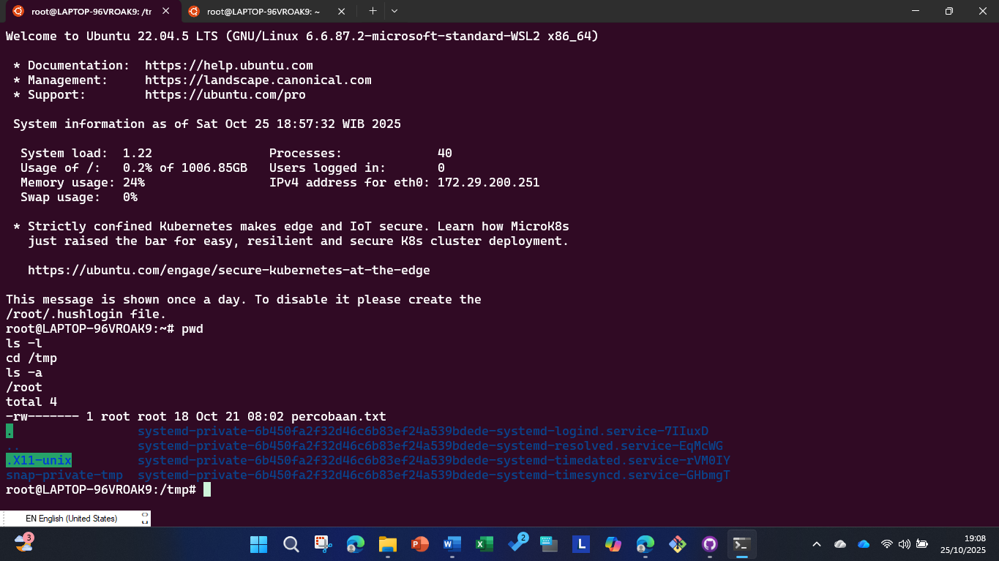
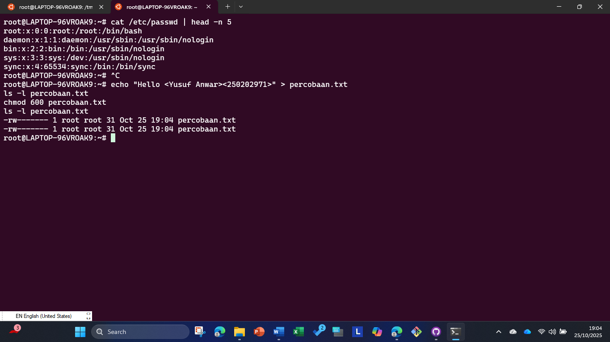
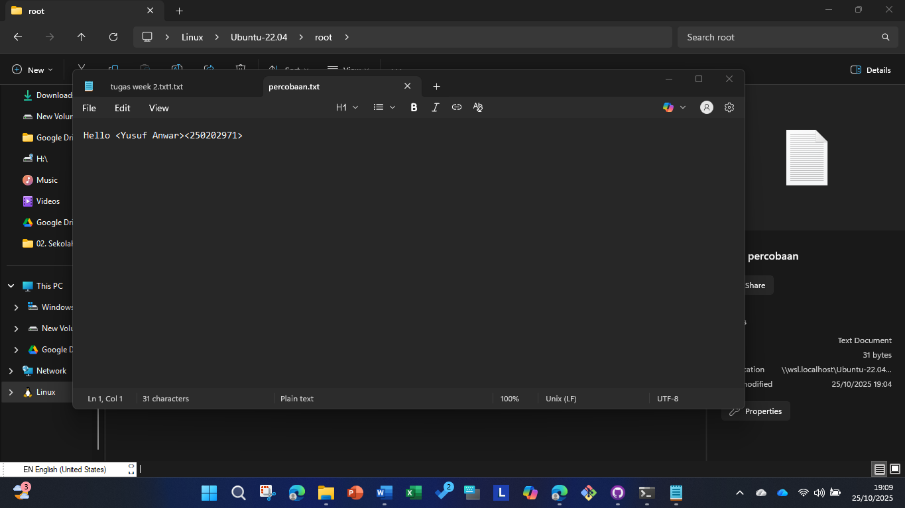
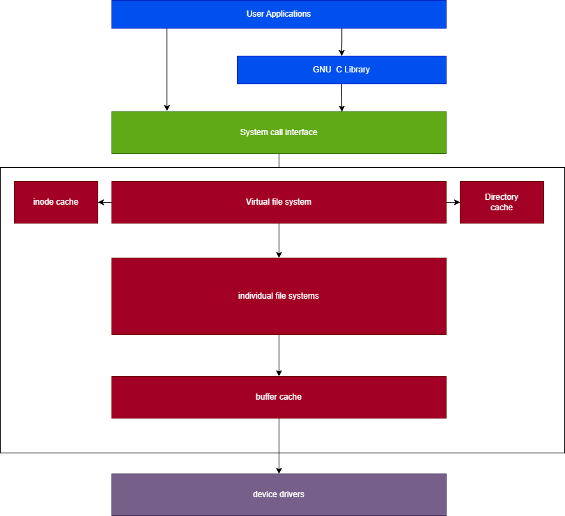

# Laporan Praktikum Minggu [3]
Topik: Manajemen File dan Permission di Linux  

---

## Identitas
- **Nama**  : Yusuf Anwar
- **NIM**   : 250202971
- **Kelas** : 1IKRB

---

## Tujuan
Setelah menyelesaikan tugas ini, mahasiswa mampu:

1. Menggunakan perintah ls, pwd, cd, cat untuk navigasi file dan direktori.
2. Menggunakan chmod dan chown untuk manajemen hak akses file.
3. Menjelaskan hasil output dari perintah Linux dasar.
4. Menyusun laporan praktikum dengan struktur yang benar.
5. Mengunggah dokumentasi hasil ke Git Repository tepat waktu.
---

## Dasar Teori
1. Sistem File Linux: Linux menggunakan struktur file hierarki yang dimulai dari direktori root (/), dengan direktori seperti /home, /etc, dan /tmp. Navigasi dilakukan melalui perintah seperti pwd (menampilkan direktori kerja saat ini), ls (menampilkan isi direktori), cd (berpindah direktori), dan cat (membaca isi file), yang membantu pengguna memahami dan mengelola struktur file secara efisien.
2. Permission (Hak Akses): Setiap file dan direktori di Linux memiliki permission yang mengatur hak baca (read), tulis (write), dan eksekusi (execute) untuk pemilik (owner), grup (group), dan lainnya (others). Permission ditampilkan dalam format oktal atau simbolik (misalnya, rwxr-xr--), dan dikelola menggunakan perintah chmod untuk mengubah hak akses guna menjaga keamanan dan kontrol akses.
3. Ownership (Kepemilikan): File dan direktori dimiliki oleh user dan group tertentu, yang dapat diubah menggunakan perintah chown. Konsep ini penting untuk mengatur siapa yang dapat mengakses atau memodifikasi file, mendukung isolasi dan keamanan dalam sistem multi-user seperti Linux.
4. Keamanan Sistem: Permission dan ownership berperan krusial dalam keamanan Linux dengan mencegah akses tidak sah, seperti melalui pengaturan hak akses yang ketat (misalnya, chmod 600 untuk file pribadi). Ini mencegah risiko seperti modifikasi data oleh user yang tidak berwenang, sesuai dengan prinsip-prinsip keamanan dalam sistem operasi.

---

## Langkah Praktikum
1. **Setup Environment**
   - Gunakan Linux (Ubuntu/WSL).
   - Pastikan folder kerja berada di dalam direktori repositori Git praktikum:
     ```
     praktikum/week3-linux-fs-permission/
     ```

2. **Eksperimen 1 – Navigasi Sistem File**
   Jalankan perintah berikut:
   ```bash
   pwd
   ls -l
   cd /tmp
   ls -a
   ```
   - Jelaskan hasil tiap perintah.
   - Catat direktori aktif, isi folder, dan file tersembunyi (jika ada).

3. **Eksperimen 2 – Membaca File**
   Jalankan perintah:
   ```bash
   cat /etc/passwd | head -n 5
   ```
   - Jelaskan isi file dan struktur barisnya (user, UID, GID, home, shell).

4. **Eksperimen 3 – Permission & Ownership**
   Buat file baru:
   ```bash
   echo "Hello <NAME><NIM>" > percobaan.txt
   ls -l percobaan.txt
   chmod 600 percobaan.txt
   ls -l percobaan.txt
   ```
   - Analisis perbedaan sebelum dan sesudah chmod.  
   - Ubah pemilik file (jika memiliki izin sudo):
   ```bash
   sudo chown root percobaan.txt
   ls -l percobaan.txt
   ```
   - Catat hasilnya.

5. **Eksperimen 4 – Dokumentasi**
   - Ambil screenshot hasil terminal dan simpan di:
     ```
     praktikum/week3-linux-fs-permission/screenshots/
     ```
   - Tambahkan analisis hasil pada `laporan.md`.

6. **Commit & Push**
   ```bash
   git add .
   git commit -m "Minggu 3 - Linux File System & Permission"
   git push origin main
   ```

---

## Kode / Perintah
Tuliskan potongan kode atau perintah utama:
```bash
uname -a
lsmod | head
dmesg | head
```

---

## Hasil Eksekusi
Sertakan screenshot hasil percobaan atau diagram:








---

## Analisis
1. **Jelaskan Fungsi Tiap Perintah dan Arti Kolom Permission:**
   - `pwd`: Menampilkan direktori kerja saat ini.
   - `ls -l`: Menampilkan isi direktori dalam format detail.
   - `cd`: Mengubah direktori.
   - `cat`: Menampilkan isi file.
   - `chmod`: Mengubah permission file.
   - `chown`: Mengubah owner dan group file.
   - Arti kolom permission `rwxr-xr--`:
     - `rwx`: Owner (read, write, execute).
     - `r-x`: Group (read, execute; no write).
     - `r--`: Other (read only; no write/execute).
     - Total: 754 dalam oktal (rwx=7, r-x=5, r--=4).
2. analisis peran
   - `chmod`: Mengontrol hak akses (read, write, execute) untuk owner, group, dan other. Penting untuk keamanan karena mencegah akses tidak sah, e.g., file sensitif seperti password hanya bisa diakses root.
   - `chown`: Mengubah kepemilikan file. Berguna untuk delegasi akses atau isolasi, e.g., file sistem dimiliki root untuk mencegah modifikasi oleh user biasa. Kombinasi keduanya memastikan model keamanan berbasis permission Linux (DAC - Discretionary Access Control).


---

## Kesimpulan
1. **Pemahaman Perintah Dasar Linux**: Praktikum ini berhasil memperkenalkan penggunaan perintah navigasi seperti `ls`, `pwd`, `cd`, dan `cat` untuk mengelola file dan direktori, serta membaca isi file seperti `/etc/passwd`, yang membantu dalam eksplorasi sistem file Linux.
2. **Konsep Permission dan Ownership**: Melalui eksperimen dengan `chmod` dan `chown`, saya memahami pentingnya hak akses file untuk keamanan sistem, di mana permission mengontrol akses read/write/execute, sementara ownership menentukan pemilik file, mencegah akses tidak sah.
3. **Dokumentasi dan Pengelolaan Repositori**: Proses dokumentasi hasil, penyimpanan screenshot, dan commit ke Git repository menunjukkan pentingnya praktik versioning dalam pengembangan, memastikan hasil praktikum terorganisir dan dapat diakses tepat waktu.
   
---

## Quiz
1. **Apa fungsi dari perintah `chmod`?**  
   `chmod` digunakan untuk mengubah hak akses (permission) file atau direktori, seperti read, write, dan execute untuk owner, group, dan other.

2. **Apa arti dari kode permission `rwxr-xr--`?**  
   - Owner: read, write, execute (rwx).  
   - Group: read, execute (r-x).  
   - Other: read only (r--).  
   - Ini setara dengan 754 dalam oktal.

3. **Jelaskan perbedaan antara `chown` dan `chmod`.**  
   `chown` mengubah kepemilikan file (owner dan group), sedangkan `chmod` mengubah hak akses (permission) tanpa mengubah kepemilikan. `chown` fokus pada siapa yang memiliki file, sementara `chmod` fokus pada apa yang bisa dilakukan oleh owner/group/other.

---

## Refleksi Diri
1. Apa bagian yang paling menantang minggu ini?
Bagian yang paling menantang adalah Eksperimen 3, khususnya penggunaan chmod dan chown untuk mengatur permission dan ownership file, karena konsep permission (seperti kode oktal 600) terasa abstrak dan memerlukan pemahaman mendalam tentang keamanan sistem Linux, terutama saat menggunakan sudo untuk mengubah owner.

2. Bagaimana cara Anda mengatasinya?
Saya mengatasi tantangan ini dengan membaca manual Linux (man chmod dan man chown) untuk memahami sintaks dan contoh, kemudian mencoba perintah secara bertahap di terminal sambil mencatat output sebelum dan sesudah perubahan. Diskusi dengan teman dan referensi buku seperti Operating System Concepts juga membantu memperjelas konsep permission.
---

**Credit:**  
_Template laporan praktikum Sistem Operasi (SO-202501) – Universitas Putra Bangsa_
