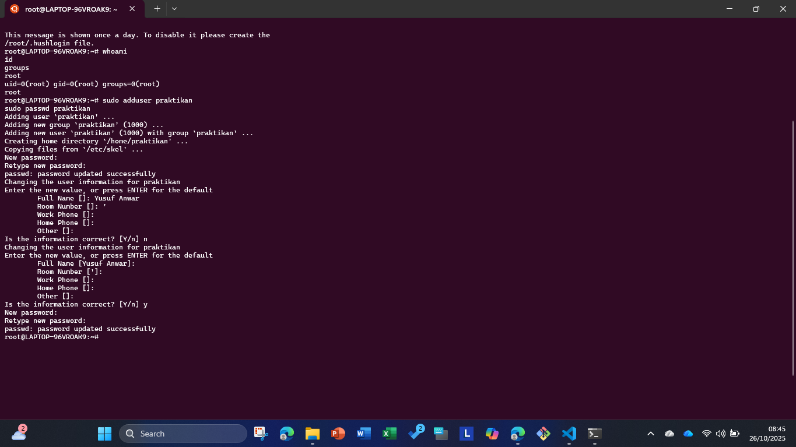
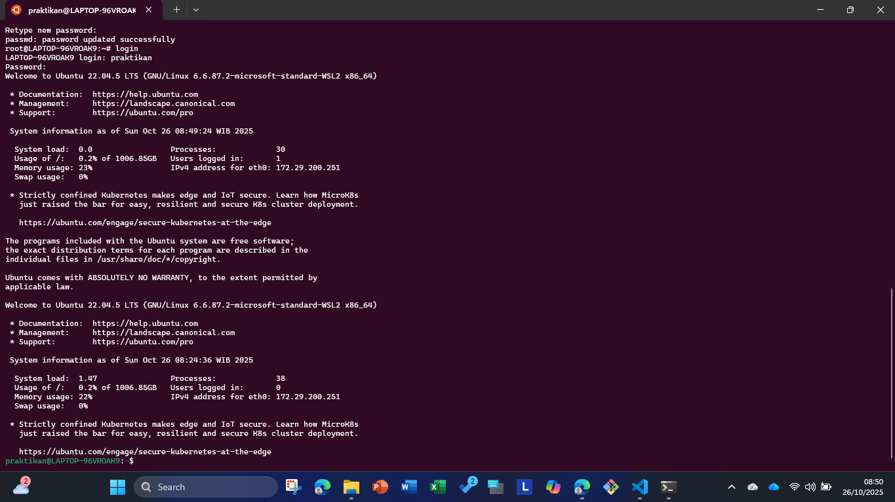
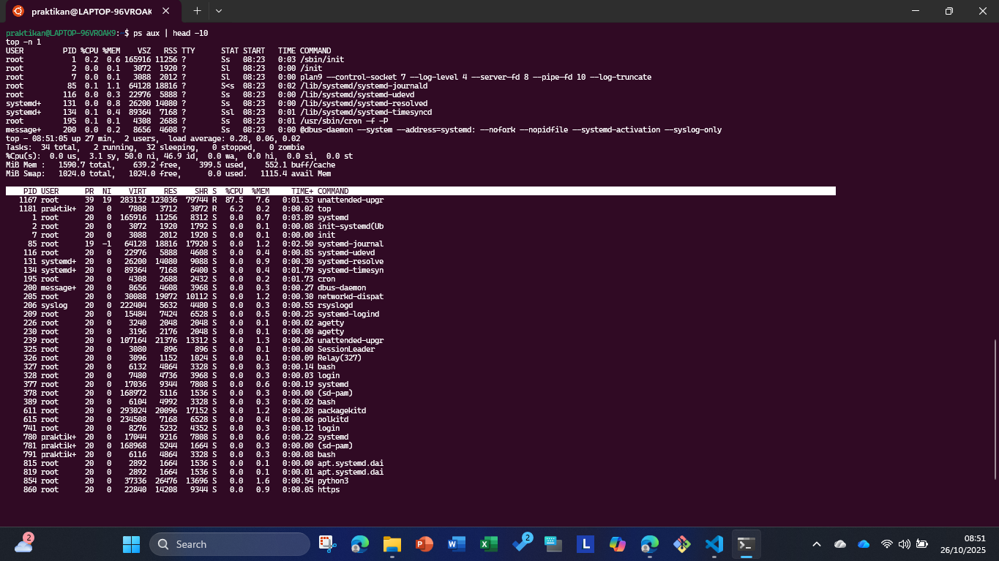
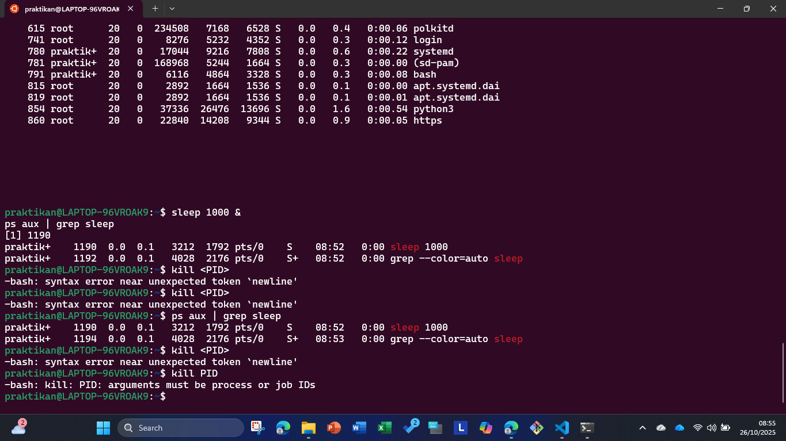
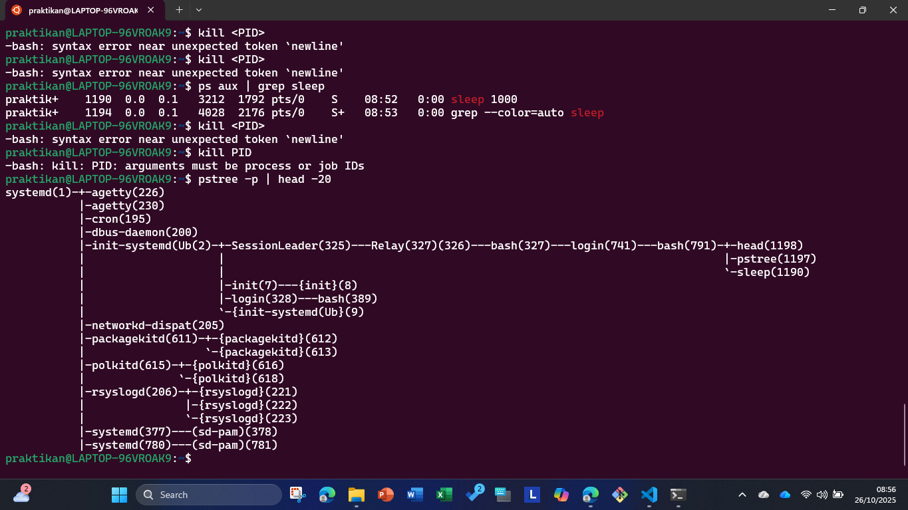

# Laporan Praktikum Minggu [X]
Topik: Manajemen Proses dan User di Linux  

---

## Identitas
- **Nama**  : Yusuf Anwar
- **NIM**   : 250202971
- **Kelas** : 1IKRB

---

## Tujuan
Setelah menyelesaikan tugas ini, mahasiswa mampu:
1. Menjelaskan konsep proses dan user dalam sistem operasi Linux.  
2. Menampilkan daftar proses yang sedang berjalan dan statusnya.  
3. Menggunakan perintah untuk membuat dan mengelola user.  
4. Menghentikan atau mengontrol proses tertentu menggunakan PID.  
5. Menjelaskan kaitan antara manajemen user dan keamanan sistem. 

---

## Dasar Teori
Tuliskan ringkasan teori (3–5 poin) yang mendasari percobaan.

---

## Langkah Praktikum
1. **Setup Environment**
   - Gunakan Linux (Ubuntu/WSL).  
   - Pastikan Anda sudah login sebagai user non-root.  
   - Siapkan folder kerja:
     ```
     praktikum/week4-proses-user/
     ```

2. **Eksperimen 1 – Identitas User**
   Jalankan perintah berikut:
   ```bash
   whoami
   id
   groups
   ```
   - Jelaskan setiap output dan fungsinya.  
   - Buat user baru (jika memiliki izin sudo):
     ```bash
     sudo adduser praktikan
     sudo passwd praktikan
     ```
   - Uji login ke user baru.

3. **Eksperimen 2 – Monitoring Proses**
   Jalankan:
   ```bash
   ps aux | head -10
   top -n 1
   ```
   - Jelaskan kolom penting seperti PID, USER, %CPU, %MEM, COMMAND.  
   - Simpan tangkapan layar `top` ke:
     ```
     praktikum/week4-proses-user/screenshots/top.png
     ```

4. **Eksperimen 3 – Kontrol Proses**
   - Jalankan program latar belakang:
     ```bash
     sleep 1000 &
     ps aux | grep sleep
     ```
   - Catat PID proses `sleep`.  
   - Hentikan proses:
     ```bash
     kill <PID>
     ```
   - Pastikan proses telah berhenti dengan `ps aux | grep sleep`.

5. **Eksperimen 4 – Analisis Hierarki Proses**
   Jalankan:
   ```bash
   pstree -p | head -20
   ```
   - Amati hierarki proses dan identifikasi proses induk (`init`/`systemd`).  
   - Catat hasilnya dalam laporan.

6. **Commit & Push**
   ```bash
   git add .
   git commit -m "Minggu 4 - Manajemen Proses & User"
   git push origin main
   ```

---

## Kode / Perintah
Tuliskan potongan kode atau perintah utama:
```bash
uname -a
lsmod | head
dmesg | head
```

---

## Hasil Eksekusi










---

## Analisis
1. 
   
    ``` bash
    systemd (PID 1)
    ├── agetty (PID 226)
    ├── agetty (PID 230)
    ├── cron (PID 195)
    ├── dbus-daemon (PID 200)
    ├── init-systemd(Ub (PID 2)
    │   ├── SessionLeader (PID 325)
    │   │   └── Relay(327)(326) (PID 327)
    │   │       └── bash (PID 327)
    │   │           └── login (PID 741)
    │   │               └── bash (PID 791)
    │   │                   ├── head (PID 1198)
    │   │                   ├── pstree (PID 1197)
    │   │                   └── sleep (PID 1190)
    │   ├── init (PID 7)
    │   │   └── {init} (PID 8)
    │   ├── login (PID 328)
    │   │   └── bash (PID 389)
    │   └── {init-systemd(Ub} (PID 9)
    ├── networkd-dispat (PID 205)
    ├── packagekitd (PID 611)
    │   ├── {packagekitd} (PID 612)
    │   └── {packagekitd} (PID 613)
    ├── polkitd (PID 615)
    │   ├── {polkitd} (PID 616)
    │   └── {polkitd} (PID 618)
    ├── rsyslogd (PID 206)
    │   ├── {rsyslogd} (PID 221)
    │   ├── {rsyslogd} (PID 222)
    │   └── {rsyslogd} (PID 223)
    ├── systemd (PID 377)
    │   └── (sd-pam) (PID 378)
    └── systemd (PID 780)
        └── (sd-pam) (PID 781)
    
    ```
3. **Hubungan antara User Management dan Keamanan Sistem Linux:** Manajemen user di Linux melibatkan pembuatan user, pengaturan password, dan penugasan grup untuk membatasi akses. User `root` memiliki hak penuh, sementara user biasa hanya dapat mengakses file mereka sendiri. Ini mencegah kerusakan sistem oleh malware atau kesalahan user. Grup memungkinkan kontrol akses bersama (misal, grup `sudo` untuk perintah administratif). Dengan demikian, manajemen user menjaga prinsip "least privilege" untuk keamanan, mencegah eskalasi hak akses, dan memungkinkan audit aktivitas.

---

## Kesimpulan
- Praktikum ini memberikan pemahaman mendalam tentang manajemen proses di Linux, termasuk monitoring dengan perintah seperti `ps` dan `top`, serta kontrol proses menggunakan `kill` berdasarkan PID.
- Konsep manajemen user, seperti identifikasi dengan `id` dan pembuatan user baru dengan `adduser`, menekankan pentingnya pengaturan hak akses untuk membatasi penggunaan sistem.
- Secara keseluruhan, praktikum ini menunjukkan hubungan erat antara manajemen user dan keamanan sistem Linux, dengan semua langkah eksperimen berhasil diselesaikan dan didokumentasikan.

---

## Quiz
1. **Apa fungsi dari proses `init` atau `systemd` dalam sistem Linux?**  
    **Jawaban:**  
Proses `init` (atau `systemd` di sistem modern) adalah proses pertama yang dijalankan setelah booting kernel. Ia bertanggung jawab atas inisialisasi sistem, peluncuran layanan, dan pengelolaan proses anak. `systemd` juga mengelola startup paralel dan pemulihan layanan.

2. **Apa perbedaan antara `kill` dan `killall`?**  
   **Jawaban:**  
`kill` mengirim sinyal ke proses berdasarkan PID (Process ID) spesifik. `killall` mengirim sinyal ke semua proses yang cocok dengan nama perintah, tanpa perlu PID. `killall` lebih mudah untuk menghentikan multiple instance, tetapi berpotensi berbahaya jika nama proses umum.

3. **Mengapa user `root` memiliki hak istimewa di sistem Linux?**  
    **Jawaban:**  
User `root` adalah superuser dengan UID 0, yang memberikan akses penuh ke semua file, perintah, dan konfigurasi sistem. Ini memungkinkan administrasi penuh, tetapi juga berisiko tinggi jika disalahgunakan, sehingga penggunaan sudo direkomendasikan untuk tugas administratif.
  
---

## Refleksi Diri
Tuliskan secara singkat:
- Apa bagian yang paling menantang minggu ini?  
- Bagaimana cara Anda mengatasinya?  

---

**Credit:**  
_Template laporan praktikum Sistem Operasi (SO-202501) – Universitas Putra Bangsa_
