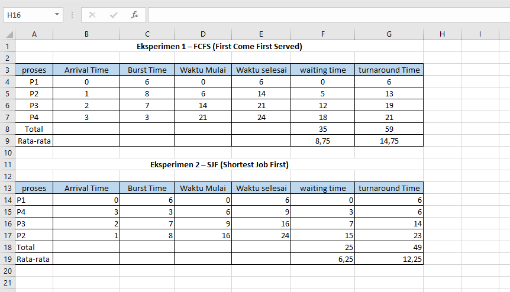
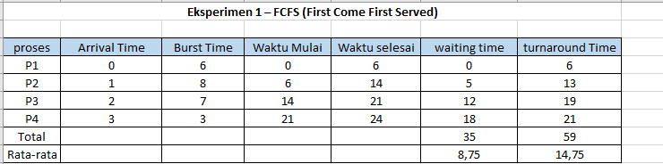
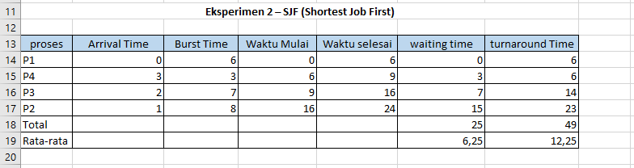

# Laporan Praktikum Minggu [5]
Penjadwalan CPU – FCFS dan SJF

---

## Identitas
- **Nama**  : Yusuf Anwar
- **NIM**   : 250202971
- **Kelas** : 1IKRB

---

## Tujuan
Setelah menyelesaikan tugas ini, mahasiswa mampu:
1. Menghitung *waiting time* dan *turnaround time* untuk algoritma FCFS dan SJF.  
2. Menyajikan hasil perhitungan dalam tabel yang rapi dan mudah dibaca.  
3. Membandingkan performa FCFS dan SJF berdasarkan hasil analisis.  
4. Menjelaskan kelebihan dan kekurangan masing-masing algoritma.  
5. Menyimpulkan kapan algoritma FCFS atau SJF lebih sesuai digunakan.

---

## Dasar Teori

1. **Penjadwalan CPU**: Penjadwalan CPU adalah mekanisme dalam sistem operasi yang menentukan urutan eksekusi proses di CPU untuk memaksimalkan utilisasi sumber daya, mengurangi waktu tunggu, dan meningkatkan throughput sistem.

2. **FCFS (First Come First Served)**: Algoritma penjadwalan non-preemptive yang mengeksekusi proses berdasarkan urutan waktu kedatangan (arrival time). Algoritma ini sederhana dan adil, tetapi dapat menyebabkan "convoy effect" di mana proses panjang memblokir proses pendek.

3. **SJF (Shortest Job First)**: Algoritma penjadwalan non-preemptive yang memprioritaskan proses dengan waktu eksekusi (burst time) terpendek yang sudah tiba. Algoritma ini optimal untuk meminimalkan rata-rata waktu tunggu, tetapi rentan terhadap "starvation" pada proses dengan burst time panjang.

4. **Metrik Performa**: Waiting Time (WT) adalah waktu proses menunggu sebelum dieksekusi, sedangkan Turnaround Time (TAT) adalah total waktu dari kedatangan hingga selesai. Kedua metrik ini digunakan untuk membandingkan efisiensi algoritma penjadwalan.

5. **Perbandingan FCFS vs SJF**: SJF umumnya lebih efisien daripada FCFS dalam hal rata-rata WT dan TAT, terutama di sistem batch, namun FCFS lebih cocok untuk sistem interaktif yang memerlukan fairness dan kesederhanaan.

---

## Langkah Praktikum
1. **Siapkan Data Proses**
   Gunakan tabel proses berikut sebagai contoh (boleh dimodifikasi dengan data baru):
   | Proses | Burst Time | Arrival Time |
   |:--:|:--:|:--:|
   | P1 | 6 | 0 |
   | P2 | 8 | 1 |
   | P3 | 7 | 2 |
   | P4 | 3 | 3 |

2. **Eksperimen 1 – FCFS (First Come First Served)**
   - Urutkan proses berdasarkan *Arrival Time*.  
   - Hitung nilai berikut untuk tiap proses:
     ```
     Waiting Time (WT) = waktu mulai eksekusi - Arrival Time
     Turnaround Time (TAT) = WT + Burst Time
     ```
   - Hitung rata-rata Waiting Time dan Turnaround Time.  
   - Buat Gantt Chart sederhana:  
     ```
     | P1 | P2 | P3 | P4 |
     0    6    14   21   24
     ```

3. **Eksperimen 2 – SJF (Shortest Job First)**
   - Urutkan proses berdasarkan *Burst Time* terpendek (dengan memperhatikan waktu kedatangan).  
   - Lakukan perhitungan WT dan TAT seperti langkah sebelumnya.  
   - Bandingkan hasil FCFS dan SJF pada tabel berikut:

     | Algoritma | Avg Waiting Time | Avg Turnaround Time | Kelebihan | Kekurangan |
     |------------|------------------|----------------------|------------|-------------|
     | FCFS | ... | ... | Sederhana dan mudah diterapkan | Tidak efisien untuk proses panjang |
     | SJF | ... | ... | Optimal untuk job pendek | Menyebabkan *starvation* pada job panjang |

4. **Eksperimen 3 – Visualisasi Spreadsheet (Opsional)**
   - Gunakan Excel/Google Sheets untuk membuat perhitungan otomatis:
     - Kolom: Arrival, Burst, Start, Waiting, Turnaround, Finish.
     - Gunakan formula dasar penjumlahan/subtraksi.
   - Screenshot hasil perhitungan dan simpan di:
     ```
     praktikum/week5-scheduling-fcfs-sjf/screenshots/
     ```

5. **Commit & Push**
   ```bash
   git add .
   git commit -m "Minggu 5 - CPU Scheduling FCFS & SJF"
   git push origin main
   ```

---

## Kode / Perintah
**Commit & Push**
 ```bash
   git add .
   git commit -m "Minggu 5 - CPU Scheduling FCFS & SJF"
   git push origin main
```

---

## Hasil Eksekusi


- FCFS

- SJF

---

## Analisis
### Tabel Perbandingan FCFS vs SJF
| Algoritma | Avg Waiting Time | Avg Turnaround Time | Kelebihan                          | Kekurangan                          |
|-----------|------------------|----------------------|------------------------------------|-------------------------------------|
| FCFS     | 8.75             | 14.75                | Sederhana dan mudah diterapkan     | Tidak efisien untuk proses panjang  |
| SJF      | 6.25             | 12.25                | Optimal untuk job pendek           | Menyebabkan starvation pada job panjang |

- **Perbandingan WT dan TAT:** SJF menghasilkan rata-rata WT dan TAT yang lebih rendah (6.25 vs 8.75 untuk WT, 12.25 vs 14.75 untuk TAT) karena proses dengan burst time pendek diprioritaskan, mengurangi waktu tunggu proses lain.
- **Kapan SJF lebih unggul:** SJF lebih unggul dalam sistem batch di mana burst time diketahui dan efisiensi waktu tunggu penting, terutama jika ada banyak proses pendek.
- **Kapan FCFS lebih sesuai:** FCFS lebih sesuai untuk sistem sederhana atau ketika fairness penting, seperti dalam antrian FIFO, meskipun kurang efisien untuk proses panjang.


---

## Kesimpulan
1. Perbandingan Efisiensi: SJF menghasilkan rata-rata waiting time dan turnaround time yang lebih rendah dibandingkan FCFS (6.25 vs 8.75 untuk WT, 12.25 vs 14.75 untuk TAT), menunjukkan keunggulan SJF dalam mengoptimalkan performa sistem untuk proses dengan burst time pendek.

2. Kelebihan dan Kekurangan: FCFS sederhana dan adil, cocok untuk sistem sederhana, tetapi kurang efisien; SJF efisien namun rentan terhadap starvation pada proses panjang, sehingga lebih sesuai untuk sistem batch di mana burst time diketahui.

3. Aplikasi Praktis: Dalam skenario nyata, SJF direkomendasikan untuk optimasi waktu tunggu di lingkungan batch, sedangkan FCFS lebih baik untuk sistem interaktif yang memerlukan fairness dan kesederhanaan implementasi.

---

## Quiz
1. Apa perbedaan utama antara FCFS dan SJF?   
   **Jawaban:** FCFS menjadwalkan proses berdasarkan urutan waktu kedatangan (first come, first served), sedangkan SJF menjadwalkan berdasarkan burst time terpendek yang sudah datang.
2. Mengapa SJF dapat menghasilkan rata-rata waktu tunggu minimum?  
   **Jawaban:**  SJF memprioritaskan proses dengan burst time pendek, sehingga proses lain menunggu lebih sedikit waktu secara keseluruhan, mengoptimalkan rata-rata waktu tunggu.

3. Apa kelemahan SJF jika diterapkan pada sistem interaktif?  
   **Jawaban:**  SJF dapat menyebabkan starvation pada proses dengan burst time panjang karena mereka terus ditunda oleh proses pendek, dan tidak memperhitungkan responsivitas atau prioritas interaktif.


---

## Refleksi Diri
Tuliskan secara singkat:
- Apa bagian yang paling menantang minggu ini?  
  Bagian yang paling menantang adalah menghitung dan mengurutkan proses untuk algoritma SJF, karena harus mempertimbangkan burst time terpendek sambil memperhatikan arrival time, yang mudah salah jika tidak disimulasikan langkah demi langkah.


- Bagaimana cara Anda mengatasinya?  
  Saya mengatasinya dengan membuat simulasi manual pada kertas, menggambar Gantt Chart sederhana, dan memverifikasi perhitungan menggunakan spreadsheet untuk memastikan urutan dan waktu yang benar. Jika bingung, saya mengacu pada referensi buku seperti Silberschatz untuk konfirmasi konsep.
---

**Credit:**  
_Template laporan praktikum Sistem Operasi (SO-202501) – Universitas Putra Bangsa_
