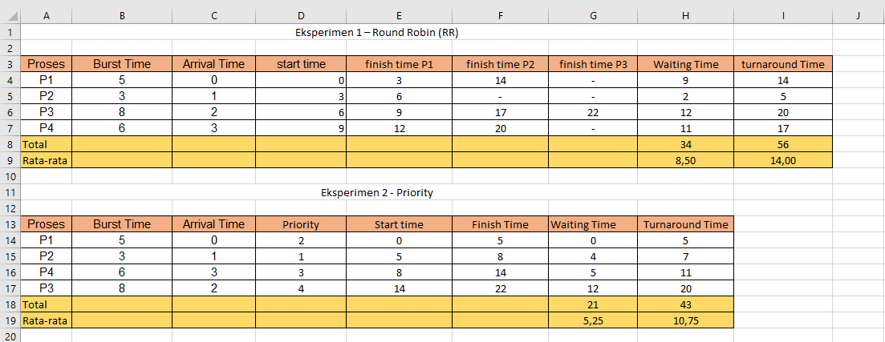
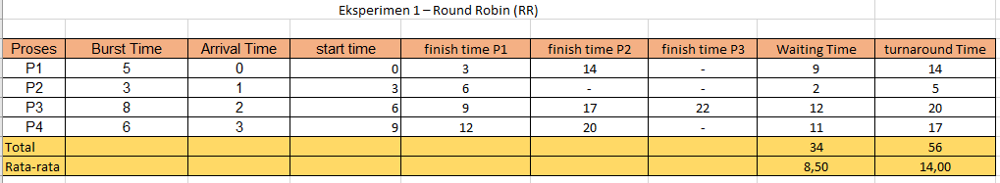
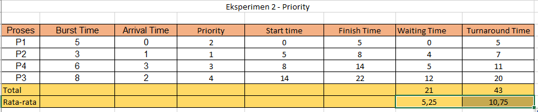

# Laporan Praktikum Minggu [X]
Penjadwalan CPU – Round Robin (RR) dan Priority Scheduling 

---

## Identitas
- **Nama**  : Yusuf Anwar
- **NIM**   : 250202971
- **Kelas** : 1IKRB

---

## Tujuan
Setelah menyelesaikan tugas ini, mahasiswa mampu:
1. Menghitung *waiting time* dan *turnaround time* pada algoritma RR dan Priority.  
2. Menyusun tabel hasil perhitungan dengan benar dan sistematis.  
3. Membandingkan performa algoritma RR dan Priority.  
4. Menjelaskan pengaruh *time quantum* dan prioritas terhadap keadilan eksekusi proses.  
5. Menarik kesimpulan mengenai efisiensi dan keadilan kedua algoritma.

---

## Dasar Teori
1. Penjadwalan CPU: Penjadwalan CPU adalah mekanisme sistem operasi untuk mengalokasikan waktu CPU kepada proses yang siap dieksekusi, dengan tujuan memaksimalkan utilisasi CPU, meminimalkan waktu tunggu (waiting time), dan memastikan keadilan antar proses. Algoritma penjadwalan dibagi menjadi preemptive (dapat diinterupsi) dan non-preemptive (tidak dapat diinterupsi).
2. Round Robin (RR): Algoritma preemptive yang menggunakan konsep time quantum (q), di mana setiap proses mendapat alokasi waktu CPU sebanyak q secara bergantian. Jika proses belum selesai dalam q, ia kembali ke antrian. RR mempromosikan keadilan, terutama untuk sistem interaktif, namun dapat meningkatkan overhead context switching jika q terlalu kecil.
3. Priority Scheduling: Algoritma yang mengeksekusi proses berdasarkan tingkat prioritas (angka kecil = prioritas tinggi). Versi non-preemptive mengeksekusi proses hingga selesai tanpa interupsi, sedangkan preemptive dapat menggantikan proses jika ada yang lebih prioritas tinggi. Algoritma ini efisien untuk proses kritis, tetapi berisiko menyebabkan starvation pada proses prioritas rendah.
4. Metrik Performa: Performa algoritma diukur melalui Waiting Time (WT: waktu tunggu sebelum eksekusi) dan Turnaround Time (TAT: total waktu dari arrival hingga selesai). Rata-rata WT dan TAT digunakan untuk membandingkan efisiensi dan keadilan algoritma.
---

## Langkah Praktikum
1. **Siapkan Data Proses**
   Gunakan contoh data berikut (boleh dimodifikasi sesuai kebutuhan):
   | Proses | Burst Time | Arrival Time | Priority |
   |:--:|:--:|:--:|:--:|
   | P1 | 5 | 0 | 2 |
   | P2 | 3 | 1 | 1 |
   | P3 | 8 | 2 | 4 |
   | P4 | 6 | 3 | 3 |

2. **Eksperimen 1 – Round Robin (RR)**
   - Gunakan *time quantum (q)* = 3.  
   - Hitung *waiting time* dan *turnaround time* untuk tiap proses.  
   - Simulasikan eksekusi menggunakan Gantt Chart (manual atau spreadsheet).  
     ```bash 
     | P1 | P2 | P3 | P4 | P1 | P3 | P4 | P4 |
     0    3    6    9   12   15   18    21   24 
     
     ```
   - Catat sisa *burst time* tiap putaran.

3. **Eksperimen 2 – Priority Scheduling (Non-Preemptive)**
   - Urutkan proses berdasarkan nilai prioritas (angka kecil = prioritas tinggi).  
   - Lakukan perhitungan manual
   - Buat tabel perbandingan hasil RR dan Priority.

4. **Eksperimen 3 – Analisis Variasi Time Quantum (Opsional)**
   - Ubah *quantum* menjadi 2 dan 5.  
   - Amati perubahan nilai rata-rata *waiting time* dan *turnaround time*.  
   - Buat tabel perbandingan efek *quantum*.

5. **Eksperimen 4 – Dokumentasi**
   - Simpan semua hasil tabel dan screenshot ke
   - Buat tabel perbandingan 

6. **Commit & Push**
   ```bash
   git add .
   git commit -m "Minggu 6 - CPU Scheduling RR & Priority"
   git push origin main
   ```

---

## Kode / Perintah
```bash
     WT[i] = waktu mulai eksekusi - Arrival[i]
     TAT[i] = WT[i] + Burst[i]
```

---

## Hasil Eksekusi







---

## Analisis
## A. Tabel Perbandingan Efek Quantum
| Quantum | Average WT | Average TAT | Pengaruh |
|---------|------------|-------------|----------|
| 3       | 8,50          | 14,0       | Keseimbangan antara adil dan efisiensi |
---

## B. Perbandingan Algoritma RR dan Priority
| Algoritma          | Avg WT | Avg TAT | Kelebihan                          | Kekurangan                          |
|--------------------|--------|---------|------------------------------------|-------------------------------------|
| Round Robin (q=3)  | 8,50      | 14,0    | Adil terhadap semua proses         | Tidak efisien jika quantum tidak tepat; overhead context switch |
| Priority (Non-Preemptive) | 5.25   | 10.75   | Efisien untuk proses penting       | Potensi starvation pada prioritas rendah |


## Kesimpulan
1. RR dengan q=3 memberikan keseimbangan antara keadilan dan efisiensi, dengan avg WT 8,50 dan TAT 14,0.
2. Priority lebih cepat untuk proses penting (avg TAT 10.75), tapi berisiko terjadinya starvation.
3. Variasi q mempengaruhi performa: q kecil meningkatkan keadilan tapi overhead; q besar seperti FCFS.
4. Kedua algoritma cocok untuk sistem berbeda: RR untuk interaktif, Priority untuk real-time.
---

## Quiz
1. Apa perbedaan utama antara Round Robin dan Priority Scheduling?  
   **Jawaban:** Round Robin adalah preemptive dengan time quantum untuk keadilan, sedangkan Priority Scheduling (non-preemptive) berdasarkan prioritas proses, di mana proses prioritas tinggi dieksekusi lebih dulu tanpa interupsi. 
2. Apa pengaruh besar/kecilnya time quantum terhadap performa sistem? 
   **Jawaban:** Time quantum kecil meningkatkan keadilan dan responsivitas, tapi meningkatkan overhead context switch. Time quantum besar mengurangi overhead tapi membuat sistem kurang adil, mirip FCFS untuk proses panjang. 
3. Mengapa algoritma Priority dapat menyebabkan starvation?
   **Jawaban:**  Karena proses prioritas rendah mungkin terus ditunda jika proses prioritas tinggi terus datang, sehingga tidak pernah mendapat kesempatan eksekusi.

---

## Refleksi Diri
Tuliskan secara singkat:
- Apa bagian yang paling menantang minggu ini?  
- Bagaimana cara Anda mengatasinya?  

---

**Credit:**  
_Template laporan praktikum Sistem Operasi (SO-202501) – Universitas Putra Bangsa_
