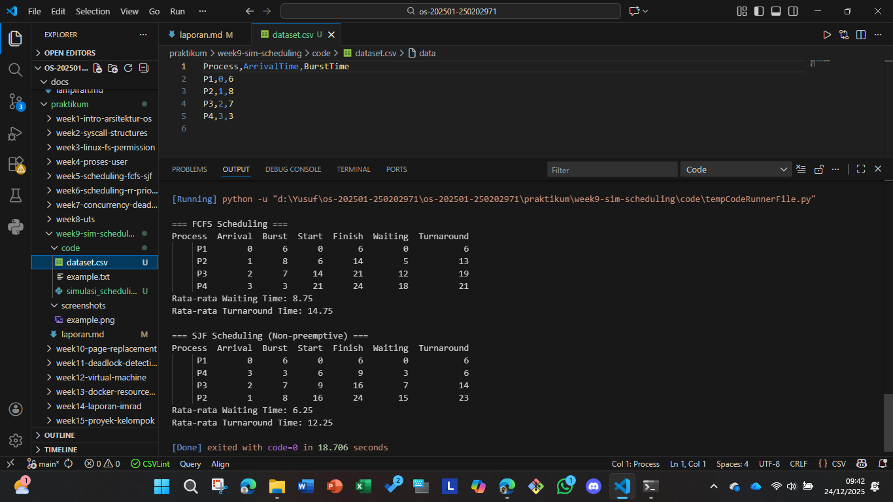

# Laporan Praktikum Minggu [X]
Topik: Simulasi Algoritma Penjadwalan CPU  

---

## Identitas
- **Nama**  : Yusuf Anwar
- **NIM**   : 250202971
- **Kelas** : 1IKRB

---

## Tujuan
Setelah menyelesaikan tugas ini, mahasiswa mampu:
1. Membuat program simulasi algoritma penjadwalan FCFS dan/atau SJF.  
2. Menjalankan program dengan dataset uji yang diberikan atau dibuat sendiri.  
3. Menyajikan output simulasi dalam bentuk tabel atau grafik.  
4. Menjelaskan hasil simulasi secara tertulis.  
5. Mengunggah kode dan laporan ke Git repository dengan rapi dan tepat waktu.
---

## Dasar Teori
## B. Dasar Teori

### 1. Penjadwalan CPU
Penjadwalan CPU adalah mekanisme sistem operasi untuk menentukan urutan eksekusi proses dalam *ready queue*.  
Tujuan utama penjadwalan adalah:
- Memaksimalkan utilisasi CPU
- Meminimalkan waktu tunggu rata-rata
- Meningkatkan throughput sistem

Kriteria penjadwalan meliputi:
- **CPU Utilization**: menjaga agar CPU tetap sibuk
- **Throughput**: jumlah proses selesai per satuan waktu
- **Waiting Time**: waktu rata-rata proses menunggu di *ready queue*
- **Turnaround Time**: total waktu dari proses masuk hingga selesai
- **Response Time**: waktu dari permintaan hingga pertama kali mendapat CPU


### 2. Algoritma FCFS (First Come, First Served)
- **Prinsip:** Proses dijalankan sesuai urutan kedatangan.  
- **Karakteristik:** Non-preemptive (proses tidak bisa dihentikan sebelum selesai).  
- **Kelebihan:** Mudah diimplementasikan, adil sesuai urutan kedatangan.  
- **Kekurangan:** Dapat menimbulkan *convoy effect* (proses kecil menunggu lama jika ada proses besar datang lebih dulu).

### 3. Algoritma SJF (Shortest Job First)
- **Prinsip:** Proses dengan burst time paling pendek dijalankan lebih dulu.  
- **Karakteristik:** Bisa non-preemptive atau preemptive (SRTF – Shortest Remaining Time First).  
- **Kelebihan:** Optimal dalam meminimalkan rata-rata waktu tunggu.  
- **Kekurangan:** Sulit diterapkan karena sistem harus mengetahui burst time proses secara akurat; berpotensi menimbulkan *starvation* untuk proses panjang.

---

## Langkah Praktikum
1. **Menyiapkan Dataset**

   Buat dataset proses minimal berisi:

   | Proses | Arrival Time | Burst Time |
   |:--:|:--:|:--:|
   | P1 | 0 | 6 |
   | P2 | 1 | 8 |
   | P3 | 2 | 7 |
   | P4 | 3 | 3 |

2. **Implementasi Algoritma**

   Program harus:
   - Menghitung *waiting time* dan *turnaround time*.  
   - Mendukung minimal **1 algoritma (FCFS atau SJF non-preemptive)**.  
   - Menampilkan hasil dalam tabel.

3. **Eksekusi & Validasi**

   - Jalankan program menggunakan dataset uji.  
   - Pastikan hasil sesuai dengan perhitungan manual minggu sebelumnya.  
   - Simpan hasil eksekusi (screenshot).


---

## Kode / Perintah
```bash
import pandas as pd

# Dataset proses
processes = [
    {"Process": "P1", "Arrival": 0, "Burst": 6},
    {"Process": "P2", "Arrival": 1, "Burst": 8},
    {"Process": "P3", "Arrival": 2, "Burst": 7},
    {"Process": "P4", "Arrival": 3, "Burst": 3},
]

# -------------------------------
# Algoritma FCFS
# -------------------------------
def fcfs(processes):
    processes = sorted(processes, key=lambda x: x["Arrival"])
    time = 0
    results = []
    for p in processes:
        start = max(time, p["Arrival"])
        finish = start + p["Burst"]
        turnaround = finish - p["Arrival"]
        waiting = turnaround - p["Burst"]
        results.append({
            "Process": p["Process"],
            "Arrival": p["Arrival"],
            "Burst": p["Burst"],
            "Start": start,
            "Finish": finish,
            "Waiting": waiting,
            "Turnaround": turnaround
        })
        time = finish
    return results

# -------------------------------
# Algoritma SJF (Non-preemptive)
# -------------------------------
def sjf(processes):
    processes = sorted(processes, key=lambda x: x["Arrival"])
    time = 0
    results = []
    ready_queue = []
    done = set()

    while len(results) < len(processes):
        # Tambahkan proses yang sudah tiba ke ready queue
        for p in processes:
            if p["Arrival"] <= time and p["Process"] not in done:
                ready_queue.append(p)
                done.add(p["Process"])

        if ready_queue:
            # Pilih proses dengan burst terkecil
            ready_queue.sort(key=lambda x: x["Burst"])
            p = ready_queue.pop(0)
            start = max(time, p["Arrival"])
            finish = start + p["Burst"]
            turnaround = finish - p["Arrival"]
            waiting = turnaround - p["Burst"]
            results.append({
                "Process": p["Process"],
                "Arrival": p["Arrival"],
                "Burst": p["Burst"],
                "Start": start,
                "Finish": finish,
                "Waiting": waiting,
                "Turnaround": turnaround
            })
            time = finish
        else:
            time += 1  # jika tidak ada proses siap, waktu maju

    return results

# -------------------------------
# Eksekusi & Output
# -------------------------------
def print_table(results, title):
    df = pd.DataFrame(results)
    print(f"\n=== {title} ===")
    print(df.to_string(index=False))
    print(f"Rata-rata Waiting Time: {df['Waiting'].mean():.2f}")
    print(f"Rata-rata Turnaround Time: {df['Turnaround'].mean():.2f}")

if __name__ == "__main__":
    fcfs_results = fcfs(processes)
    sjf_results = sjf(processes)

    print_table(fcfs_results, "FCFS Scheduling")
    print_table(sjf_results, "SJF Scheduling (Non-preemptive)")
```

---

## Hasil Eksekusi


---

## Analisis
1. **Analisis**

   - FCFS: Proses dijalankan sesuai urutan kedatangan. Proses dengan burst time besar dapat menyebabkan proses lain menunggu lama.

   - SJF: Proses dengan burst time kecil diprioritaskan, sehingga rata-rata waktu tunggu lebih rendah.

   - Kesimpulan: SJF lebih efisien dibanding FCFS dalam hal waktu tunggu rata-rata, tetapi lebih sulit diimplementasikan karena membutuhkan informasi burst time yang akurat.

2. Perbandingan FCFS vs SJF

| Aspek              | FCFS                          | SJF (Non-preemptive)              |
|--------------------|-------------------------------|-----------------------------------|
| Prinsip            | Berdasarkan urutan kedatangan | Berdasarkan burst time terpendek  |
| Jenis              | Non-preemptive                | Non-preemptive / Preemptive       |
| Kelebihan          | Mudah, adil                   | Waktu tunggu rata-rata lebih kecil|
| Kekurangan         | Convoy effect                 | Starvation untuk proses panjang   |
| Implementasi       | Sangat sederhana              | Lebih kompleks (butuh info burst) |

3. Kelebihan & Keterbatasan Simulasi

| Aspek        | Kelebihan                                                                 | Keterbatasan                                      |
|--------------|---------------------------------------------------------------------------|--------------------------------------------------|
| Otomatisasi  | Perhitungan dilakukan secara otomatis dan cepat                           | Belum mendukung algoritma preemptive (misalnya SRTF) |
| Skalabilitas | Dapat digunakan untuk dataset besar tanpa rawan kesalahan manual          | Bergantung pada input dataset yang valid          |
| Fleksibilitas| Mudah dimodifikasi untuk algoritma lain (misalnya Round Robin, Priority)  | Tidak menampilkan visualisasi Gantt Chart secara default |
| Akurasi      | Hasil konsisten dan sesuai dengan logika algoritma                        | Tidak memperhitungkan kondisi sistem nyata (I/O, interrupt) |
 

---

## Kesimpulan
- **FCFS** cocok untuk sistem sederhana dengan beban proses relatif seimbang.  
- **SJF** lebih efisien dalam mengurangi waktu tunggu rata-rata, tetapi membutuhkan informasi burst time yang akurat.  
- Simulasi kedua algoritma membantu memahami trade-off antara kesederhanaan dan efisiensi dalam penjadwalan CPU.

---

## Quiz
1. Mengapa simulasi diperlukan untuk menguji algoritma scheduling?  
   **Jawaban:**  Karena simulasi memungkinkan pengujian algoritma secara otomatis dan efisien, terutama untuk dataset besar yang sulit dihitung manual.
2. Apa perbedaan hasil simulasi dengan perhitungan manual jika dataset besar?  
   **Jawaban:**  Perhitungan manual rawan kesalahan dan memakan waktu, sedangkan simulasi memberikan hasil cepat dan akurat.
3. Algoritma mana yang lebih mudah diimplementasikan? Jelaskan.  
   **Jawaban:**  FCFS lebih mudah diimplementasikan karena hanya membutuhkan pengurutan berdasarkan waktu kedatangan tanpa logika pemilihan proses berdasarkan burst time.

---

## Refleksi Diri
Tuliskan secara singkat:
- Apa bagian yang paling menantang minggu ini?  
   **Jawaban:**  Tantangan terbesar adalah memahami cara mengimplementasikan algoritma penjadwalan CPU (FCFS dan SJF) ke dalam bentuk program dan Mengubah logika perhitungan manual menjadi kode Python.
- Bagaimana cara Anda mengatasinya?  
   **Jawaban:**  Saya mengatasinya dengan mempelajari kembali konsep dasar algoritma, membandingkan hasil simulasi dengan perhitungan manual, da melakukan uji coba program secara bertahap.

---

**Credit:**  
_Template laporan praktikum Sistem Operasi (SO-202501) – Universitas Putra Bangsa_
